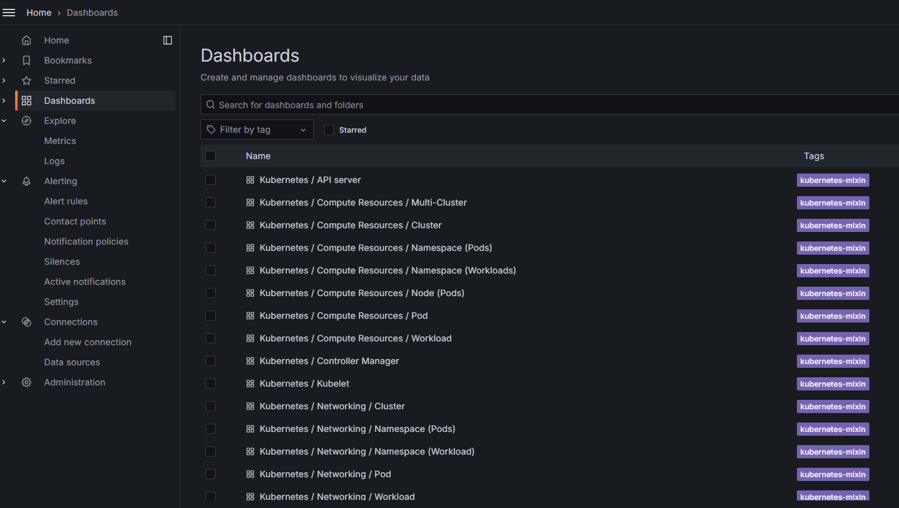
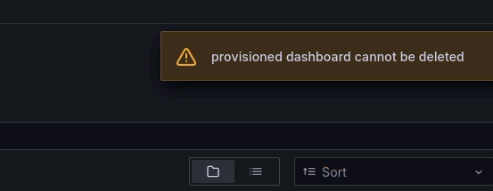
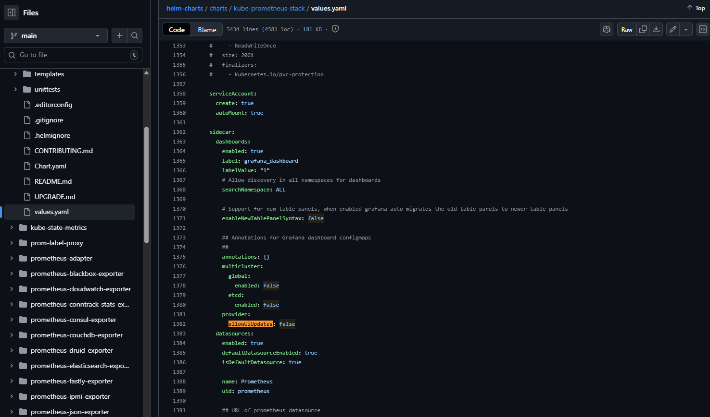
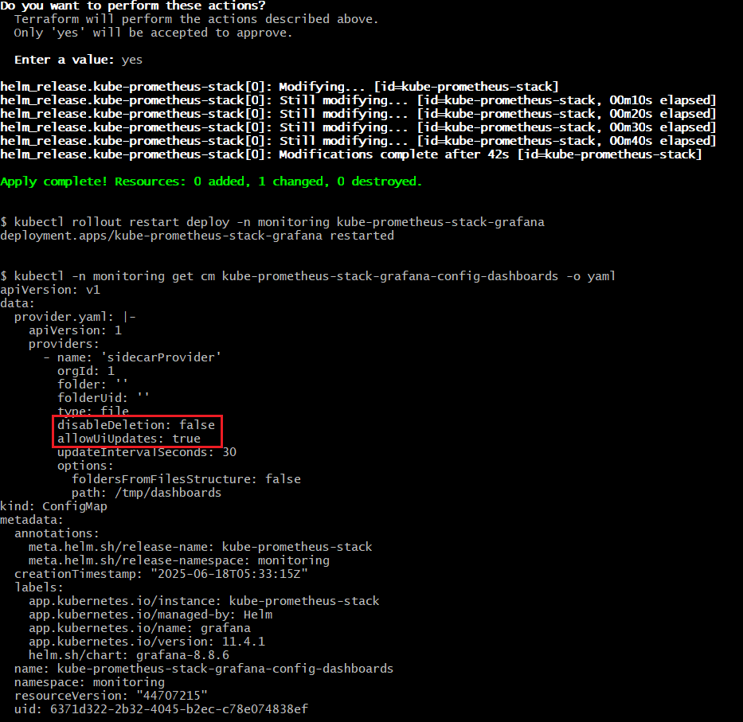
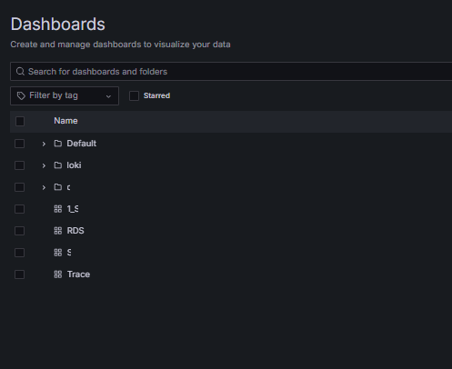

### 배경

* Grafana는 특별히 설정을 주지 않고 배포하면 다음과 같이 기본적으로 제공되는 대시보드들이 존재한다.
  

* 불필요한 대시보드로 인해 불편함이 있다는 의견이 있어, 이걸 제거해보기로 한다.

#### 현 상황 및 설정 값 확인

* 만약, 삭제나 디렉토리로 이동을 시도하면 `provisioned dashboard cannot be deleted`가 발생한다.
  

* 이를 위해, [kube-prometheus-stack](https://github.com/prometheus-community/helm-charts/blob/main/charts/kube-prometheus-stack/values.yaml) values 파일을 참고하도록 한다.

* 필요한 설정은 다음 두 가지다. Key 자체가 가진 의미가 확실해서 설명은 필요하지 않을 듯 하다.
 1. grafana.defaultDashboardsEnabled: false 
 2. grafana.sidecar.dashboards.provider.allowUiUpdates: true
   

#### Terraform 배포

* 우리는 Terraform을 활용한 IaC 개발로 오픈소스를 배포하고 있기 때문에 해당 옵션을 아래와 같이 추가해준다.
  
```
resource "helm_release" "kube-prometheus-stack" {
  ...
  values = [
    yamlencode({
	  grafana = {
        defaultDashboardsEnabled  = false
        defaultDashboardsTimezone = "Asia/Seoul"
        adminPassword             = "admin"
        "grafana.ini" = {
          server = {
            root_url            = "%(protocol)s://%(domain)s/grafana"
            serve_from_sub_path = true
          }
        }
        sidecar = {
          dashboards = {
            provider = {
              allowUiUpdates = true
            }
          }
        }
	})
  ]
 }
```

* 이후, `$ terraform apply`

#### 결과

* `$ kubectl get cm kube-prometheus-stack-grafana-config-dashboards -o yaml` 명령어를 통해서 아래와 같이 결과를 확인한다.
  
  
* Grafana UI 에서 배포 후, 즉시 지워진 모습
  

