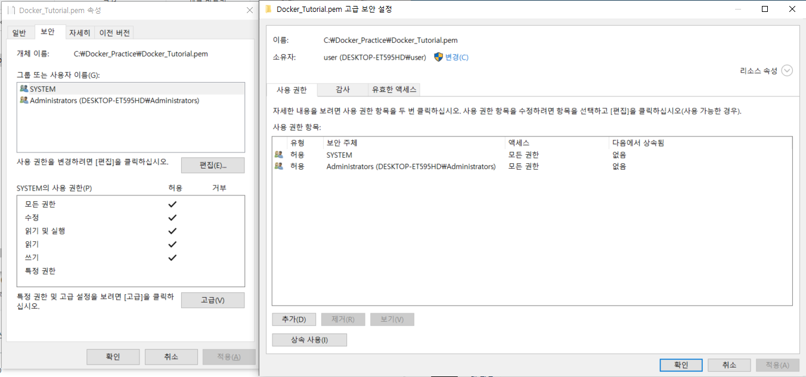
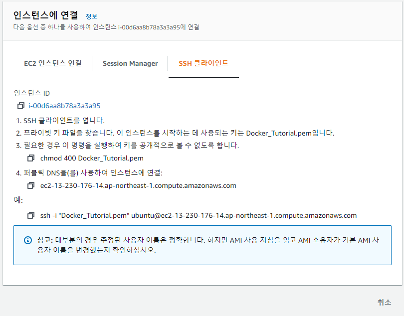
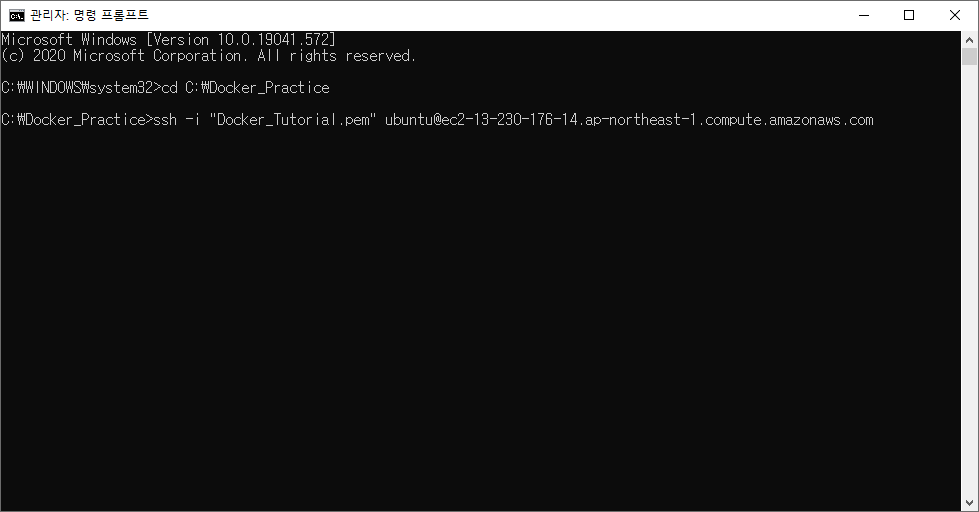
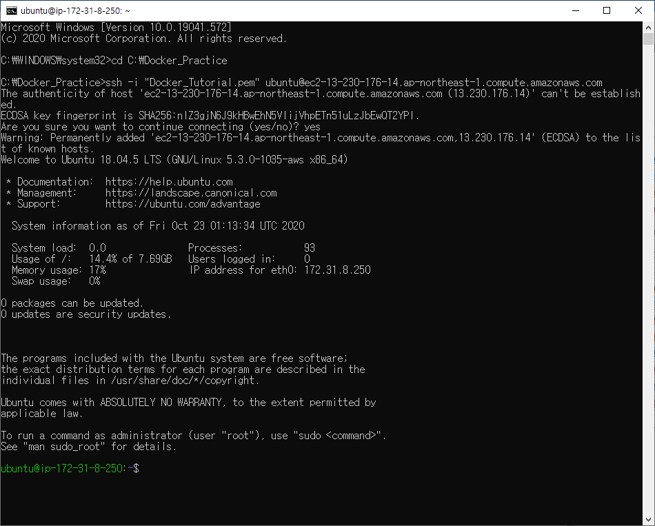

### 실습용 AWS EC2 인스턴스 생성 및 접속

* 인스턴스 생성 - ubuntu 18.04 -> 키 페어 생성 'Docker_Tutorial.pem'

* pem 파일 우클릭 - '고급' - '상속 사용하지 않음' 을 클릭하여 '상속 사용'으로 변경.
  * Linux : chmod 400 해당 키 페어 - 보안 설정
  * Windows : 속성 - 사용자 보안 설정 Admin, System만 가능하게 끔.

* AWS 인스턴스 - '연결' - 'SSH 클라이언트' - **ssh **  명령어 복사.

* '명령 프롬프트' 관리자 권한으로 실행 - ssh 명령어로 서버에 접속.

* 접속 완료.