### Jupyter Notebook 설치

* GUI 환경으로 도움 받기 위하여 콘솔이 아니라 웹 브라우저 환경에서 해당 서버에 바로 접근하여 서버를 관리할 수 있다.

``` $ sudo apt-get update ```</br>

``` $ sudo apt-get install python3-pip ```</br>

``` $ sudo pip3 install notebook ```</br>

* 주피터 비밀번호 생성

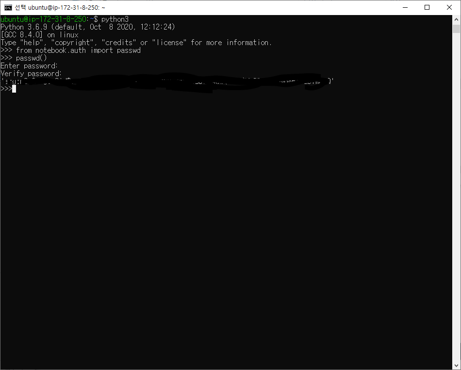

``` $ python3 ``` </br>

``` $ from notebook.auth import passwd ``` </br> - notebook.auth library

``` $ passwd() ``` </br>

* 비밀번호 설정 이후 나온 해시 값은 저장해둔다.

``` $ exit() ```

* jupyter 환경 설정 파일 생성

``` $ jupyter notebook --generate-config ``` </br>

``` $ sudo vi /home/ubuntu/.jupyter/jupyter_notebook_config.py ``` </br>

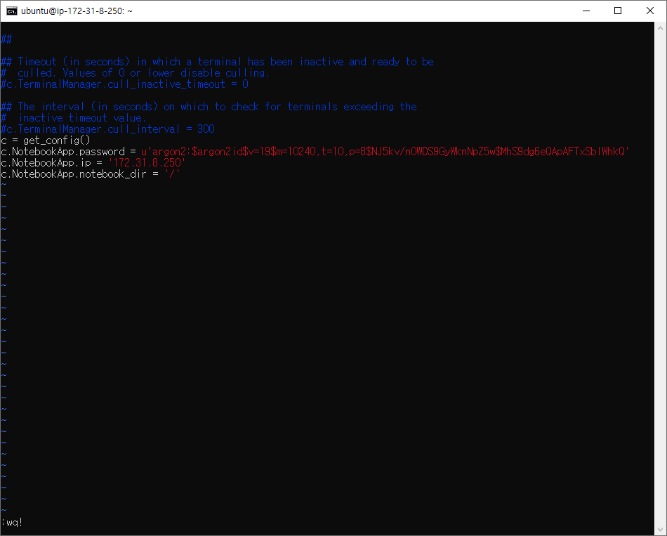

```
c = get_config()
c.NotebookApp.password = u'해시값'
c.NotebookApp.id = 'IP 주소'
c.NotebookApp.notebook_dir='/'
```

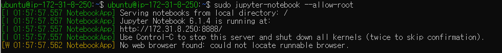

``` $ sudo jupyter-notebook --allow-root ``` - root권한을 가진 상태로 jupyter notebook을 실행.

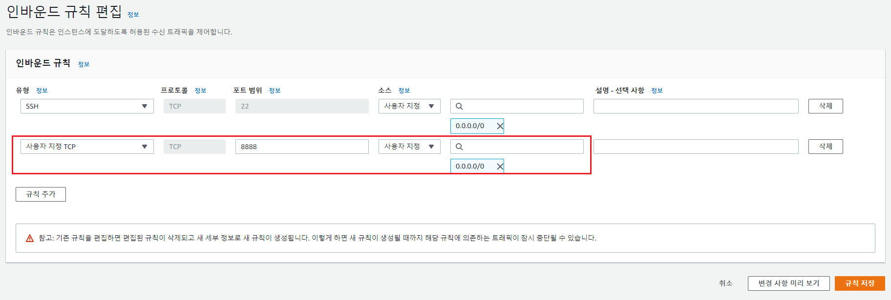

* 방화벽 설정.


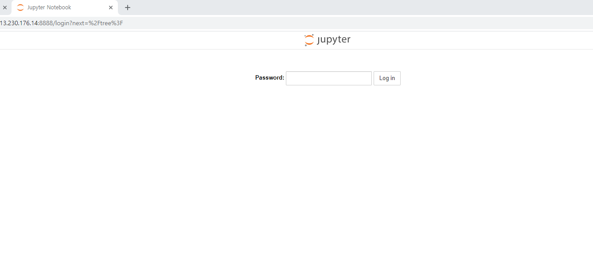

* 퍼블릭 IPv4 주소 : 8888로 접속

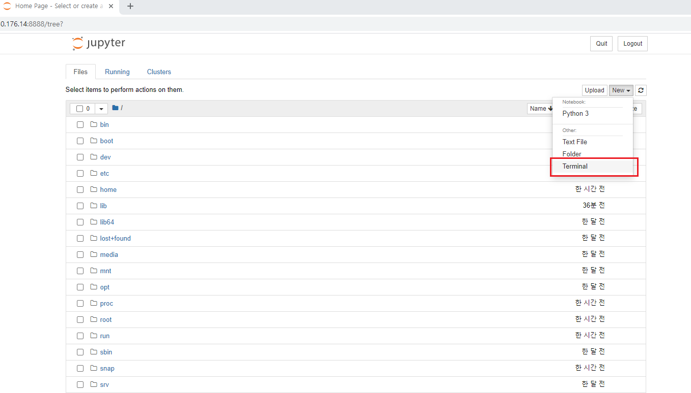


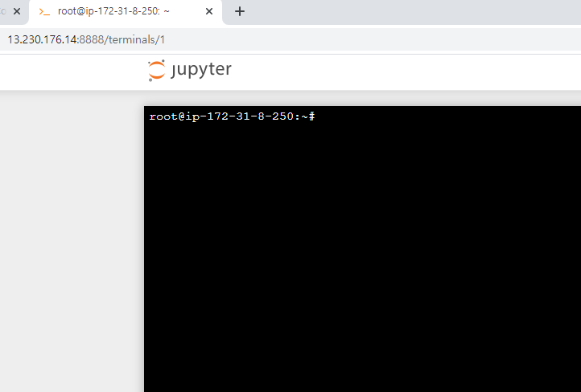

* 더이상 ssh가 필요하지 않고 웹 브라우저에서 바로 서버에 접속할 수 있게 된다.


* 주피터 노트북을 항상 실행될 수 있게 만든다.  


``` $ bg ```</br>

``` $ disown -h ```

* 백그라운드에서 돌아갈 수 있게하고, 소유권을 포기하게 한다.

---

### HTTPS 적용 (주피터 노트북에 SSL 적용)

``` $ cd /home/ubuntu ```</br>

``` $ mkdir ssl ```</br>

``` $ cd ssl ```</br>

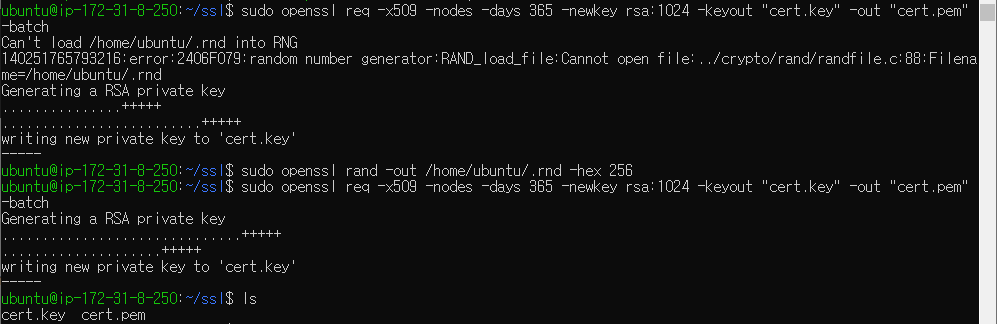

* 'cert.key' 개인키, 'cert.pem' 공개키를 만든다.

``` $ sudo openssl req -x509 -nodes -days 365 -newkey rsa:1024 -keyout "cert.key" -out "cert.pem" -batch ```</br>

* 오류 발생
  * Can't load /home/ubuntu/.rnd into RNG 140251765793216:error:2406F079:random number generator:RAND_load_file:Cannot open file:../crypto/rand/randfile.c:88:Filename=/home/ubuntu/.rnd
  * ``` $ sudo openssl rand -out /home/ubuntu/.rnd -hex 256 ``` - 누락 파일 생성.</br>
    * *참고(https://github.com/node-opcua/node-opcua-pki/issues/7)*

* 이후 다시 명령어 입력하여 개인키, 공개키 생성.

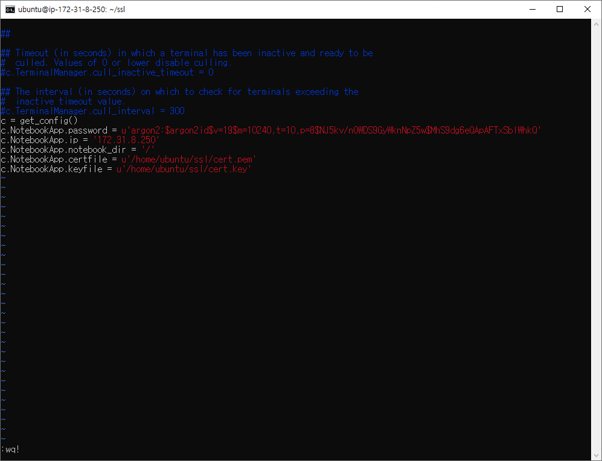

* 다시 환경 설정 파일로 들어가 개인키, 공개키 경로 입력.

* 이후 ``` $ sudo jupyter-notebook --allow-root ``` 명령어를 통해 주피터 노트북을 실행.


* **https**://{IP 주소}:8888로 접속 - '고급' - IP 주소(안전하지 않음) 으로 접속.


---

### 시스템 서비스 설정하기

``` $ which jupyter-notebook ```</br>

-> /usr/local/bin/jupyter-notebook

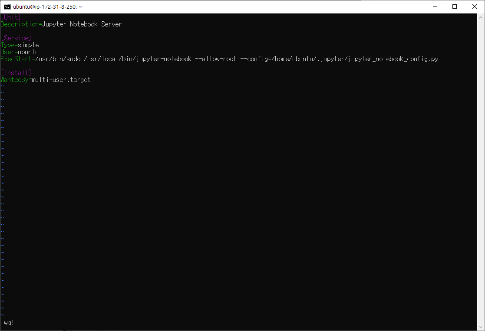

 ``` $ sudo vi /etc/systemd/system/jupyter.service ``` - service 파일 생성 후 작성</br> 

```
[Unit]
Description=Jupyter Notebook Server

[Service]
Type=simple
User=ubuntu
ExecStart=/usr/bin/sudo /usr/local/bin/jupyter-notebook --allow-root --config=/home/ubuntu/.jupyter/jupyter_notebook_config.py

[Install]
WantedBy=multi-user.target
```

``` $ sudo systemctl daemon-reload ```</br>

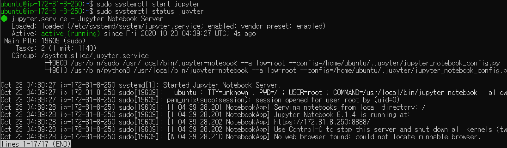

``` $ sudo systemctl enable jupyter ```</br>

``` $ sudo systemctl start jupyter ```</br>