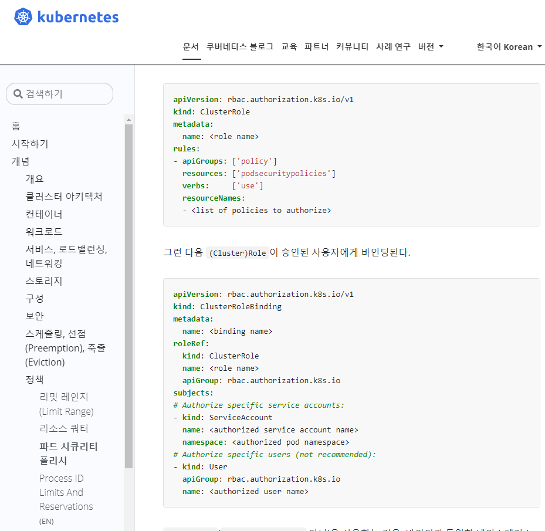
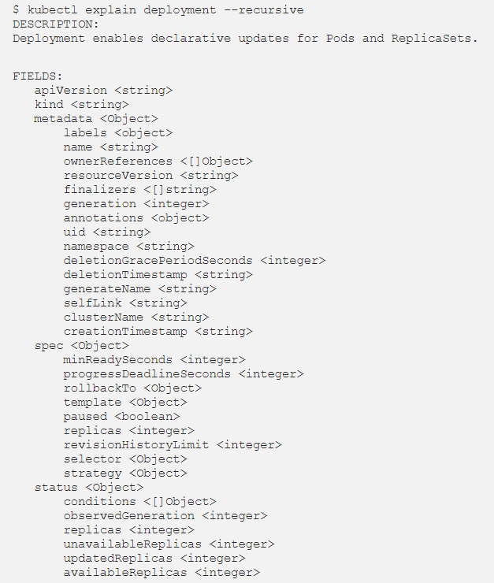

##### Docs 문서내의 '개념', '작업', '참조 - API', 'kubectl 치트시트' 및 kubectl 커맨드 Docs를 활용하자.

* CKA는 오픈북 시험이다. 따라서, 완벽하게 모든 명령어와 yaml 생성 방법을 숙지할 수 없다면 Docs 문서를 참고하면서 학습하는 것이 도움이 된다.
  * https://kubernetes.io/docs/concepts/
  * https://kubernetes.io/docs/tasks/
  * https://kubernetes.io/docs/reference/kubernetes-api/
  * https://kubernetes.io/docs/user-guide/kubectl-cheatsheet/
  * https://kubernetes.io/docs/reference/generated/kubectl/kubectl-commands



* 위처럼 yaml 생성 방식 등이 자세히 나와있다. 

---

##### kubectl explain --recurive 명령어를 사용하면, 리소스 개체의 구조를 파악하기 쉽다.



---

##### ETCD 백업, 복원 명령어는 필수

```yaml
# Backup
ETCDCTL_API=3 etcdctl \ 
--endpoints {endpoint url} \ 
--cert={etcd-client.crt} \ 
--key={etcd-client.key} \ 
--cacert={etcd-ca.crt} \ 
snapshot save etcd-backup.db 

# Restore ETCDCTL_API=3 etcdctl \ 
--endpoints {endpoint url} \ 
--cert={etcd-cert.crt} \ 
--key={etcd-key.key} \ 
--cacert={etcd-ca.crt} \ 
--data-dir={backup-dir-path} \ 
--initial-advertise-peer-urls={address} \ 
--initial-cluster={address} \ 
--name=${name} \ 
snapshot restore etcd-backup.db
```

---

##### 클러스터 업그레이드 순서

* 업그레이드는 기본 노드에서 하는 것이 아님
  1. node drain
  2. kubeadm upgrade
  3. kubelet upgrade
  4. kubectl upgrade
  5. node uncordon