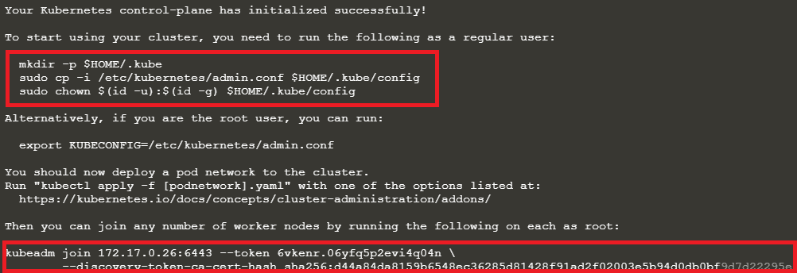

Q) Install the `kubeadm` package on master and node01

https://kubernetes.io/docs/setup/production-environment/tools/kubeadm/install-kubeadm

A)

**데비안 기반 배포**

```shell
#1. Kubernetes 리포지토리를 사용하는 데 필요한 패키지 인덱스를 업데이트하고 패키지를 설치합니다.
sudo apt-get update
sudo apt-get install -y apt-transport-https ca-certificates curl

#2. Google 클라우드 공개 서명 키 다운로드:
sudo curl -fsSLo /usr/share/keyrings/kubernetes-archive-keyring.gpg https://packages.cloud.google.com/apt/doc/apt-key.gpg

#3. Kubernetes 리포지토리 추가
echo "deb [signed-by=/usr/share/keyrings/kubernetes-archive-keyring.gpg] https://apt.kubernetes.io/ kubernetes-xenial main" | sudo tee /etc/apt/sources.list.d/kubernetes.list

#4. 패키지 업데이트 및 kubelet, kubeadm, kubectl 설치
sudo apt-get update
sudo apt-get install -y kubelet kubeadm kubectl
sudo apt-mark hold kubelet kubeadm kubectl

#5. 명령어로 설치 확인
kubeadm 
```

control plane에서 kubeadm 설치가 되었고, node01에서 설치를 하기 위해	

`ssh node01` 명령어를 사용하고 위의 명령어를 동일하게 적용하여 kubeadm 생성

---

https://kubernetes.io/docs/setup/production-environment/tools/kubeadm/create-cluster-kubeadm/#initializing-your-control-plane-node

Q) Initialize `Control Plane Node (Master Node)`

Once done, set up the `default kubeconfig` file and wait for node to be part of the cluster.

A) `kubeadm init`



```shell
mkdir -p $HOME/.kube
sudo cp -i /etc/kubernetes/admin.conf $HOME/.kube/config
sudo chown $(id -u):$(id -g) $HOME/.kube/config
```

---

Q) Generate a kubeadm join token

##### 토큰을 분실한 경우

`kubeadm token create --print-join-command`

---

Q) Join `node01` to the cluster using the join token

A) A) kubeadm init시에 나왔던 `kubeadm join` 구문을 복사

---

Q) Install a Network Plugin. As a default, we will go with `weave`

A)

```shell
sysctl net.bridge.bridge-nf-call-iptables=1
ssh node01
sysctl net.bridge.bridge-nf-call-iptables=1
```

* https://www.weave.works/docs/net/latest/kubernetes/kube-addon/#-installation

```shell
kubectl apply -f "https://cloud.weave.works/k8s/net?k8s-version=$(kubectl version | base64 | tr -d '\n')"
```

