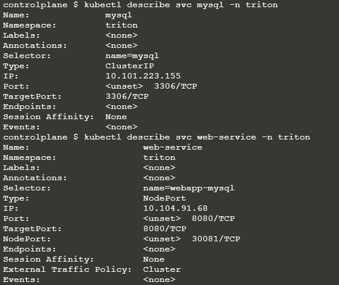
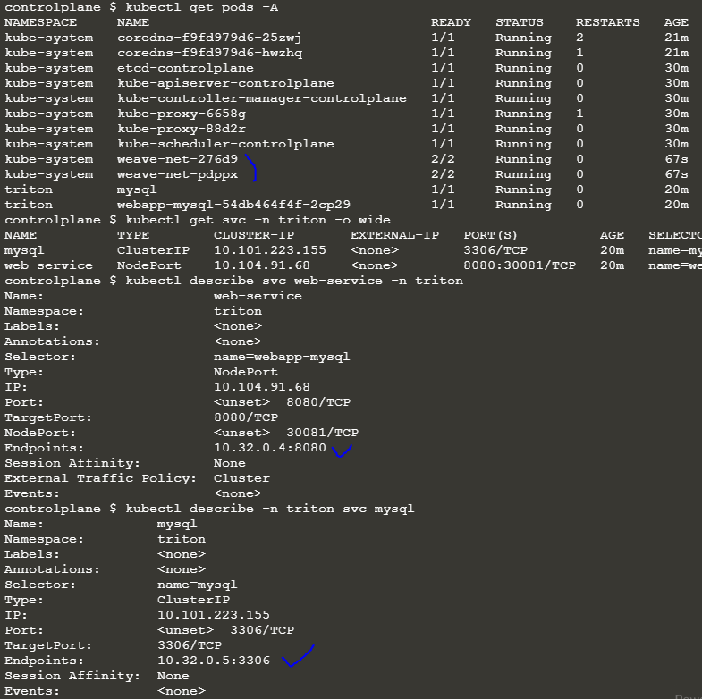

Q) 

 A simple 2 tier application is deployed in the `triton` namespace. It must display a green web page on success. Click on the app tab at the top of your terminal to view your application. It is currently failed. Troubleshoot and fix the issue.


A) 

```shell
# HINT
Do the services in triton namespace have a valid endpoint? If they do, check the kube-proxy and the weave logs.
Does the cluster have a Network Addon installed?

Install Weave using the link: https://kubernetes.io/docs/setup/production-environment/tools/kubeadm/create-cluster-kubeadm/#pod-network

For example: kubectl apply -f "https://cloud.weave.works/k8s/net?k8s-version=$(kubectl version | base64 | tr -d '\n')"
```

* 서비스 먼저 확인 - 엔드 포인트가 유효하지 않음.



* `kubectl apply -f "https://cloud.weave.works/k8s/net?k8s-version=$(kubectl version | base64 | tr -d '\n')"`



---

Q) 동일한 구조에서 문제가 발생

A) 

```shell
# HINT
서비스 프록시에 문제가 있는 것 같습니다. kube-proxy 데몬셋을 검사하고 수정합니다.
kube-proxy 포드의 로그를 확인합니다. 데몬세트가 잘못된 구성 파일을 사용하고 있는 것 같습니다.
데몬셋에 사용된 구성 파일을 kube-proxy에 대한 구성 맵과 비교합니다.
kubectl -n kube-system edit ds kube-proxy를 사용하여 구성 파일을 수정하도록 kube-proxy 데몬세트를 편집합니다.

The kube-proxy pods are not running. As a result the rules needed to allow connectivity  to the services have not been created.

kube-proxy 포드가 실행되고 있지 않습니다. 그 결과 서비스에 대한 연결을 허용하는 데 필요한 규칙이 생성되지 않았습니다.

1. kube-proxy Pod의 로그 확인
$ kubectl -n kube-system logs <name_of_the_kube_proxy_pod>
 
2. 구성 파일 /var/lib/kube-proxy/configuration.conf가 유효하지 않습니다. 구성 경로가 ConfigMap의 데이터와 일치하지 않습니다.
$ kubectl -n kube-system describe configmap kube-proxy는 사용된 파일 이름이 /var/lib/kube-proxy/config.conf 경로의 kube-proxy damonset 포드에 마운트된 config.conf임을 보여줍니다.

3. 그러나 kube-proxy용 DaemonSet에서 kube-proxy 포드를 시작하는 데 사용되는 명령은 /var/lib/kube-proxy/configuration.conf 경로를 사용합니다.

ConfigMap에 따라 이 경로를 /var/lib/kube-proxy/config.conf로 수정하고 kube-proxy 팟(Pod)을 다시 작성하십시오.

이렇게 하면 kube-proxy 포드가 다시 실행 상태로 돌아갑니다.
```

1. kube-proxy pod의 로그 확인 `kubectl get configmap -n kube-system`


* 구성파일 `~/configuration.conf`가 유효하지 않음.

2. `kubectl describe configmap kube-proxy -n kube-system` 는 `/var/lib/kube-proxy/kubeconfig.conf` 경로의 kube-proxy daemonset 포드에 마운트된 conf임을 보여준다.


3. 그러나 kube-proxy용 DaemonSet에서 kube-proxy 포드를 시작하는 데 사용되는 커맨드는 `/var/lib/kube-proxy/configuration.conf`이므로 이를 수정.

* `kubectl edit -n kube-system configmap kube-proxy`

---

Q) 

A) 

```shell
# HINT
Is the DNS resolution of the services working? Inspect the kube-dns pod and service.
Does the kube-dns service have valid endpoints?

--

The kube-dns service is not working as expected. The first thing to check is if the service has a valid endpoint? Does it point to the kube-dbs/core-dns ?

Run: kubectl -n kube-system get ep kube-dns

If there are no endpoints for the service, inspect the service and make sure it uses the correct selectors and ports.

Run: kubectl -n kube-system describe svc kube-dns

Note that the selector used is: k8s-app=core-dns

If you compare this with the label set on the coredns deployment and its pods, you will see that the select should be k8s-app=kube-dns

Modify the kube-dns service and update the selector to k8s-app=kube-dns
(Easist way is to use the kubectl edit command)
```

* `kubectl -n kube-system get ep kube-dns`

  

* `kubectl -n kube-system describe svc kube-dns`

  

* coredns deploy 및 해당 pod에 설정된 레이블과 비교하면 `Selector` 항목이 `k8s-app=kube-dns`여야 함을 알 수 있다.

  

* `kube-dns service`를 수정하고 선택기를 `k8s-app=kube-dns`로 업데이트 해야한다.
  (쉬운 방법은 kubectl edit 명령을 사용하는 것)

  

* `kubectl edit svc kube-dns -n kube-system`

  파란색 박스처럼 `cube-dns` -> `kube-dns`로 수정

  

