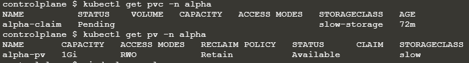
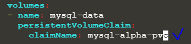
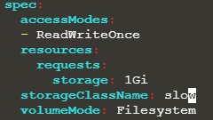

##### Q) 클러스터 업그레이드

Upgrade the current version of kubernetes from `1.18` to `1.19.0` exactly using the `kubeadm` utility. Make sure that the upgrade is carried out one node at a time starting with the master node. To minimize downtime, the deployment `gold-nginx` should be rescheduled on an alternate node before upgrading each node.

##### A) 

[Upgrading kubeadm clusters | Kubernetes](https://v1-19.docs.kubernetes.io/docs/tasks/administer-cluster/kubeadm/kubeadm-upgrade/)

```shell
## ControlPlane
apt-mark unhold kubeadm && \
apt-get update && apt-get install -y kubeadm=1.19.0-00 && \
apt-mark hold kubeadm

apt-get update && \
apt-get install -y --allow-change-held-packages kubeadm=1.19.0-00

kubeadm version
sudo kubeadm upgrade plan
sudo kubeadm upgrade apply v1.19.0

kubectl drain controlplane --ignore-daemonsets

apt-mark unhold kubelet kubectl && \
apt-get update && apt-get install -y kubelet=1.19.0-00 kubectl=1.19.0-00 && \
apt-mark hold kubelet kubectl

apt-get update && \
apt-get install -y --allow-change-held-packages kubelet=1.19.0-00 kubectl=1.19.0-00

sudo systemctl daemon-reload
sudo systemctl restart kubelet

kubectl uncordon controlplane

## Worker Node
ssh node01

apt-mark unhold kubeadm && \
apt-get update && apt-get install -y kubeadm=1.19.0-00 && \
apt-mark hold kubeadm

apt-get update && \
apt-get install -y --allow-change-held-packages kubeadm=1.19.0-00

exit
sudo kubeadm upgrade node

kubectl drain node01 --ignore-daemonsets
ssh node01

apt-mark unhold kubelet kubectl && \
apt-get update && apt-get install -y kubelet=1.19.0-00 kubectl=1.19.0-00 && \
apt-mark hold kubelet kubectl

apt-get update && \
apt-get install -y --allow-change-held-packages kubelet=1.19.0-00 kubectl=1.19.0-00

sudo systemctl daemon-reload
sudo systemctl restart kubelet
exit

kubectl uncordon node01
```

---

##### Q)  파싱

Print the names of all deployments in the `admin2406` namespace in the following format

`<deployment name>` `<container image used>` `<ready replica count>` `<Namespace>`

The data should be sorted by the increasing order of the deployment name.

Example:
`DEPLOYMENT CONTAINER_IMAGE READY_REPLICAS NAMESPACE`
`deploy0 nginx:alpine 1 admin2406`
Write the result to the file `/opt/admin2406_data`

##### A)

https://kubernetes.io/ko/docs/reference/kubectl/cheatsheet/

```shell
kubectl get deployment -n admin2406 -o=custom-columns='DEPLOYMENT:metadata.name','CONTAINER_IMAGE:spec.template.spec.containers[*].image','READY_REPLICAS:spec.replicas','NAMESPACE:metadata.namespace' --sort-by metadata.name  > /opt/admin2406_data
```

---

##### Q) config

A kubeconfig file called `admin.kubeconfig` has been created in /root/CKA. There is something wrong with the configuration. Troubleshoot and fix it.

##### A) 

```shell
kubectl config view # :6443
cat /root/CKA/admin.kubeconfig # :2379 server port is wrong (2379 -> 6443)
```

---

##### Q) 롤링 업데이트

Create a new deployment called `nginx-deploy`, with image `nginx:1.16` and `1` replica. Next upgrade the deployment to version `1.17` using `rolling update`. Make sure that the version upgrade is recorded in the resource annotation.

##### A) 

[디플로이먼트 | Kubernetes](https://kubernetes.io/ko/docs/concepts/workloads/controllers/deployment/)

```shell
kubectl create deploy nginx-deploy --image=nginx:1.16 --replicas=1 # Deployment 생성
kubectl set image deploy nginx-deploy nginx=nginx:1.17 --record # 업데이트
kubectl rollout history deploy nignx-deploy # 확인
```

---

##### Q) pv, pvc, storageclass

A new deployment called `alpha-mysql` has been deployed in the `alpha` namespace. However, the pods are not running. Troubleshoot and fix the issue. The deployment should make use of the persistent volume alpha-pv to be mounted at `/var/lib/mysql` and should use the environment variable `MYSQL_ALLOW_EMPTY_PASSWORD=1` to make use of an empty root password.

##### Important: Do not alter the persistent volume.

##### A) 

https://kubernetes.io/docs/concepts/storage/dynamic-provisioning/



```shell
kubectl get deploy -n alpha alpha-mysql -o yaml > deploy.yaml
```



* Deployment에 정의된 pvc name 변경 (`mysql-alpha-pvc` -> `alpha-claim`)
* Storage class 생성 (https://kubernetes.io/docs/concepts/storage/storage-classes/#gce-pd)

```yaml
# vi storage.yaml
apiVersion: storage.k8s.io/v1
kind: StorageClass
metadata:
  name: slow
  namespace: alpha
provisioner: kubernetes.io/gce-pd
parameters:
  type: pd-standard
```

* `kubectl apply -f storage.yaml`

* pvc 설정 변경  (pv는 변해선 안된다고 했으므로 kubectl get pv -n alpha의 설정과 동일하게 맞춰준다.)
* `kubectl get pvc -n alpha pvc alpha-claim -o yaml > pvc.yaml`
* `kubectl delete -n alpha pvc alpha-claim`
* `vi pvc.yaml`



* `kubectl apply -f pvc.yaml`

---

##### Q) etcd 백업

Take the backup of ETCD at the location `/opt/etcd-backup.db` on the master node

##### A) 

[Operating etcd clusters for Kubernetes | Kubernetes](https://kubernetes.io/docs/tasks/administer-cluster/configure-upgrade-etcd/#snapshot-using-etcdctl-options)

```shell
ETCDCTL_API=3 etcdctl --cacert=/etc/kubernetes/pki/etcd/ca.crt --cert=/etc/kubernetes/pki/etcd/server.crt --key=/etc/kubernetes/pki/etcd/server.key snapshot save /opt/etcd-backup.db
```

---

##### Q) Secrets as files from a Pod

 Create a pod called `secret-1401` in the `admin1401` namespace using the `busybox` image. The container within the pod should be called `secret-admin` and should sleep for `4800` seconds.

The container should mount a `read-only` secret volume called `secret-volume` at the path `/etc/secret-volume`. The secret being mounted has already been created for you and is called `dotfile-secret`.

##### A) 

[Secrets | Kubernetes](https://kubernetes.io/docs/concepts/configuration/secret/#using-secrets-as-files-from-a-pod)

```shell
kubectl run secret-1401 --image=busybox --dry-run=client -o yaml > pod.yaml
vi pod.yaml
```

```yaml
## pod.yaml
apiVersion: v1
kind: Pod
metadata:
  creationTimestamp: null
  labels:
    run: secret-1401
  name: secret-1401
  namespace: admin1401 # add
spec:
  containers:
  - image: busybox
    name: secret-admin
    command: ["sleep", "4800"] # add
    resources: {}
    volumeMounts: # -- add START --
    - name: secret-volume
      mountPath: "/etc/secret-volume"
      readOnly: true
  volumes:
  - name: secret-volume
    secret:
      secretName: dotfile-secret # -- add END --
  dnsPolicy: ClusterFirst
  restartPolicy: Always
status: {}
```

* `kubectl apply -f pod.yaml`
