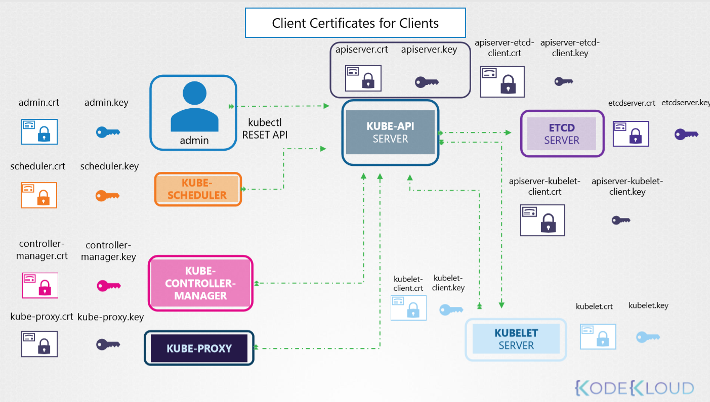
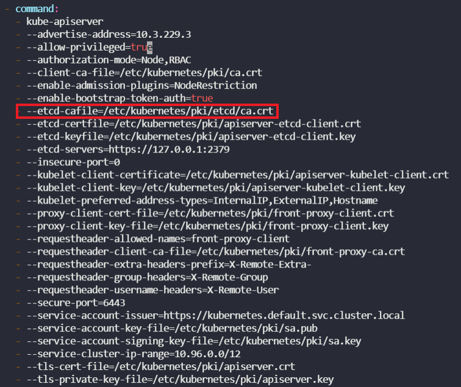

### 클러스터에서 TLS 인증서 관리

##### Kubernetes 인증서



* Kubernetes에서 동작하는 모든 controlplane은 각각의 인증서를 가지고 동작하도록 설계되어 있다. Kubernetes에서는 클라이언트도 CA로부터 인증받은 사용자만 클러스터(`kube-api server`)에 접근할 수 있다. (클라이언트 자체에 접근하는 동작은 클러스터 관리자만이 수행하는 동작이기 때문)
* 위의 이유로, Kubernetes 클러스터(`kube-api server`)에 접근하기 위해서는 클러스터의 controlplane 들의 인증서를 인증하는 CA인증서를 활용해서, 사용자가 클러스터에 접근할 때 사용할 인증서에도 싸인을 해주어야 하고, 이 작업을 위한 API(`certificates.k8s.io`)를 제공하고 있다. 
* 간단히 CSR을 생성하고, CertificateSigningRequest 객체를 yaml을 이용해 생성하여 간편하게 CA 인증 및 인증서 획득 작업을 진행할 수 있다.
* 사용자(관리자)가 접근하는 Kubernetes 클러스터는 편의상 '쿠버네티스 클러스터' 라고 지칭하였지만, 정확하게는 `kube-api server` 를 의미한다. Kubernetes Rest API, kubetctl 명령어 모두 결국 `kube-api server`서비스와 통신하기 때문

```yaml
apiVersion: certificates.k8s.io/v1 ## 쿠버네티스는 사용자가 제어하는 인증기관 (CA)에서 서명한 TLS 인증서를 프로비저닝 할 수 있는 certificates.k8s.io API를 제공한다.
#apiVersion: certificates.k8s.io/v1beta2 # 위의 것이 안된다면
kind: CertificateSigningRequest
metadata:
  name: kyy
spec:
  groups:
  - system:authenticated
  request: ~~~~
  signerName: kubernetes.io/kube-apiserver-client
  usages:
  - client auth
```

##### 인증서 세부 정보 보기

핵심 명령어★

`openssl x509 -in <crt-file-path> --text -noout`

---

Q) Identify the certificate file used for the `kube-api server`

A) `cat /etc/kubernetes/manifests/kube-apiserver.yaml` 명령 이후 `--tls-cert-file` 항목 확인

`--tls-cert-file=/etc/kubernetes/pki/apiserver.crt`


Q) Identify the Certificate file used to authenticate `kube-apiserver` as a client to `ETCD` Server

A) 위와 동일한 Command ` --etcd-certfile=/etc/kubernetes/pki/apiserver-etcd-client.crt`


Q) Identify the key used to authenticate `kube-apiserver` to the `kubelet` server

A) `--kubelet-client-key=/etc/kubernetes/pki/apiserver-kubelet-client.key`


Q) Identify the ETCD Server Certificate used to host ETCD server

A) `cat /etc/kubernetes/manifest/etcd.yaml` 

`--cert-file=/etc/kubernetes/pki/etcd/server.crt`


Q) Identify the ETCD Server CA Root Certificate used to serve ETCD Server. ETCD can have its own CA. So this may be a different CA certificate than the one used by kube-api server.

A) Look for CA Certificate **trusted-ca-file** in file `/etc/kubernetes/manifests/etcd.yaml`


Q) What is the Common Name (CN) configured on the Kube API Server Certificate? 
OpenSSL Syntax: `openssl x509 -in file-path.crt -text -noout`

A) Run the command `openssl x509 -in /etc/kubernetes/pki/apiserver.crt -text` and look for **Subject CN**.


Q) The kube-api server stopped again! Check it out. Inspect the kube-api server logs and identify the root cause and fix the issue.

Run `docker ps -a` command to identify the kube-api server container. Run `docker logs container-id` command to view the logs.


A) 

`docker ps -a | grep kube-apiserver`

`docker logs <container id> --tail 2`




