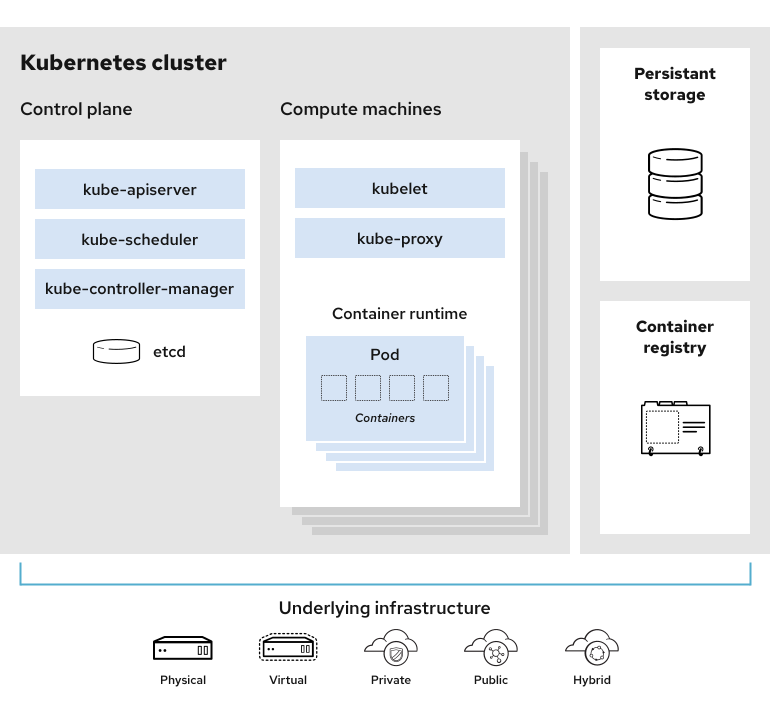

#### 쿠버네티스

* 분산형 애플리케이션 및 서비스를 규모에 맞게 실행하도록 설계된 오픈소스 컨테이너 오케스트레이션 플랫폼

##### 클러스터의 구성요소

* 클러스터: 작동 중인 쿠버네티스 배포

  * 쿠버네티스의 원하는 상태는 1. manifest로 이루어진 구성 파일로 정의됩니다. 2. 쿠버네티스 API로 정의됩니다. 이러한 정의는 커맨드라인에서(kubectl) 또는 API를 사용해 클러스터와 상호작용하여 원하는 상태를 설정하거나 수정할 수 있습니다.

* 쿠버네티스 클러스터는 **컨트롤 플레인**과 **컴퓨팅 머신(또는 노드)**의 부분으로 시각화할 수 있다.

  * 각 노드는 자체 Linux 환경이며 물리 또는 가상머신일 수 있습니다.
  * 각 노드는 컨테이너로 이루어진 Pod를 실행합니다.

  

##### ControlPlane

1. Control Plane: 클러스터를 제어하는 쿠버네티스 구성 요소와 클러스터의 상태 및 구성에 관한 데이터가 함께 있다. 노드를 제어하는 프로세스의 컬렉션으로 여기서 모든 태스크 할당이 시작된다.
2. kube-apiserver: 쿠버네티스 Control Plane의 FrontEnd로, 내부 및 외부 요청을 처리합니다. API 서버는 요청이 유효한지 판별하고 유효한 요청을 처리합니다.
3. kube-scheduler: 클러스터가 양호한지? 새 컨테이너가 필요하다면 어디에 적합한지?를 다룬다. 스케줄러는 CPU 또는 메모리와 같은 Pod의 리소스 요구 사항과 함께 클러스터를 고려하여 Pod를 적절한 컴퓨팅 노드에 스케줄합니다.
4. kube-controller-manager: 스케줄러를 참고하여 정확한 수의 포드가 실행되게 합니다.
5. etcd: 설정 데이터와 클러스터의 상태에 관한 정보를 담은 키-값 저장소 데이터베이스.

##### 쿠버네티스 용어

* 컨테이너: 실행에 필요한 모든 파일을 포함하여 전체 런타임 환경에서 애플리케이션을 패키지화하고 분리하는 기술. 이를 통해 전체 기능을 유지하면서 컨테이너화된 애플리케이션을 환경(개발, 테스트, 생산 등)간에 쉽게 이동할 수 있다.

* Control Plane: 쿠버네티스 노드를 제어하는 프로세스의 컬렉션. 여기에서 모든 태스크 할당이 시작된다.

* Node: 컨트롤 플레인에서 할당된 요청 태스크를 수행하는 머신.
* Pod: 단일 노드에 배포되는 하나 이상의 컨테이너 집합. 포드는 가장 작고 단순한 쿠버네티스 오브젝트이다.
* Service: 일련의 포드에서 네트워크 서비스로 실행 중인 애플리케이션을 노출하는 방식.
* Namespace: 가상 클러스터. 네임스페이스를 통해 쿠버네티스는 동일한 물리 클러스터 내에 이는 여러 클러스터를 관리할 수 있다.

* Deployment: 쿠버네티스가 애플리케이션의 인스턴스를 어떻게 생성하고 업데이트해야 하는지를 지시. 애플리케이션 인스턴스가 클러스터의 개별 노드에서 실행되도록 스케줄한다.
  인스턴스를 구동 중인 노드가 다운되거나 삭제되면, deployment 컨트롤러가 인스턴스를 클러스터 내부의 다른 노드의 인스턴스로 교체시켜준다.
* Kubelet: 쿠버네티스 마스터와 노드 간 통신을 책임지는 프로세스이며, 하나의 머신 상에서 동작하는 파드와 컨테이너를 관리한다.