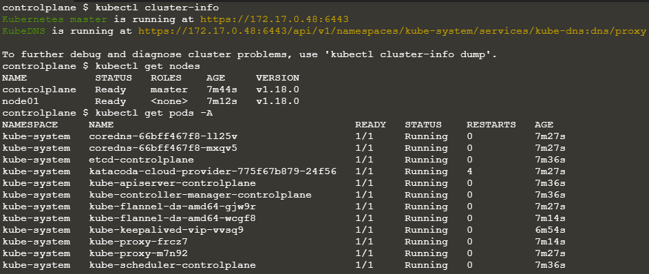

### 워크로드

##### Kubernetes에 Application을 배포하고, 외부에서 접속 할 수 있도록 설정을 하는 실습.

현재 Kubernetes 환경의 상태를 확인하기 위해서는,

`kubectl cluster-info`

`kubectl get nodes`

`kubectl get pods -A`

를 각각 실행시켜 보면 된다.



* 위의 Kubernetes Cluster 환경은, master와 node01 두개의 host로 구성되어 있으며, master node에는 control plan이 배포되고, 사용자가 배포하는 application은 모두 node01로 배포가 된다.
* kubernetes 의 최소 단위는 POD 이며, POD의 Replica 개수를 지정하는 것이 ReplicaSet, 그리고 ReplicaRest의 배포 및 롤백과 같이 History를 포함하는 것이 Deployment 

#### POD

```yml
apiVersion: v1
kind: Pod
metadata:
	name: httpd
	labels:
	 app: httpd
spec:
	containers:
	- image: ethos93/go-httpd:v1
	  imagePullPolicy: Always
	  name: httpd
	  ports:
	  - containerPort: 80
	    protocol: TCP
```

* Manifest를 살펴보면, `kind`에는 Object 종류, 그리고 `metadata`에는 name과 label을 지정하도록 되어 있다.
* `spec`에는 pod에 생성될 container의 spec을 지정한다.
* containers로 되어 있는 것을 보면 알 수 있 듯, 다수의 container를 지정하여 하나의 Pod에 여러개의 container가 실행될 수 있도록 한다. 위에서는 ethos93/go-httpd:v1 이미지와 포트 80을 사용하도록 지정.
* yaml 파일을 통해 object를 생성하는 방법은, `kubectl create -f "yaml 파일명"` 이다.
* `apply` command 또한 사용할 수 있는데, apply는 기존에 동일한 이름의 object가 없다면 create를, 동일한 이름의 object가 있다면 replace 를 시켜준다. `kubectl apply -f "yaml 파일명"`

##### ReplicaSet

* Pod에 문제가 생겼을 경우 서비스가 중단될 수 있따. 물론, Kubernetes는 문제가 생긴 Pod를 종료시키고 새로운 Pod를 생성 시키는 자동화가 되어있긴 하지만 이 동안 서비스가 불가능하기 때문에, Production 환경에서는 반드시 복수개의 Pod를 생성하여 중단 없는 서비스를 제공할 필요가 있다. 이를 위한 ReplicaSet

```yml
apiVersion: apps/v1
kind: ReplicaSet
metadata:
  name: httpd-replicaset
  labels:
    app: httpd-replicaset
spec:
  replicas: 3
  selector:
    matchLabels:
      app: httpd-replicaset
  template:
    metadata:
      labels:
        app: httpd-replicaset
    spec:
      containers:
      - image: ethos93/go-httpd:v1
        imagePullPolicy: Always
        name: httpd-replicaset
        ports:
        - containerPort: 80
          protocol: TCP
```

* replicas는 몇개의 복제본을 만들 것인지 지정하는 것
* selector는 label(template에 정의된 label)을 통해 pod를 확인하면서 현재 pod의 수를 관리한다. 
* template에는 pod의 manifest가 그대로 들어갑니다.
* 이후 `kubectl apply -f replicaset.yaml` 명령으로 생성

#### Deployment

* ReplicaSet은 image의 tag를 변경하더라도 Pod를 새롭게 만들지 않는다. ReplicaSet을 통해 새로운 버전의 image Pod를 만들기 위해서는, 기존 ReplicaSet을 삭제하고, 새롭게 ReplicaSet을 생성해 주어야 한다. 따라서, 무중단으로 서비스 되어야 하는 Production 환경에서는 적합하지 않으므로 Deployment가 필요하다.
* Deployment는 Image 버전 변경 시 Update 전략에 따라 RollingUpdate 등을 지원한다. AutoScaling도 지원하여 복제본의 수를 부하 상태에 따라 자동 조절도 해준다.

```yml
apiVersion: apps/v1
kind: Deployment
metadata:
  name: httpd-deployment
  labels:
    app: httpd-deployment
spec:
  replicas: 10
  strategy:
    type: RollingUpdate
    rollingUpdate:
      maxSurge: 1
      maxUnavailable: 0
  selector:
    matchLabels:
      app: httpd-deployment
  template:
    metadata:
      labels:
        app: httpd-deployment
    spec:
      containers:
      - image: ethos93/go-httpd:v1
        imagePullPolicy: Always
        name: httpd-deployment
        ports:
        - containerPort: 80
          protocol: TCP
```

* RollingUpdate를 지정하는 경우 maxSurge (지정된 복제본 수 이상으로 만들 Pod 수), maxUnavailable (지정된 복제본 수 보다 적게 서비스 될 수 있는 Pod 수)

d