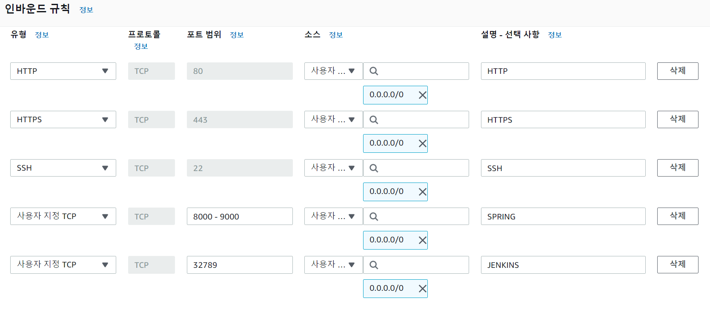
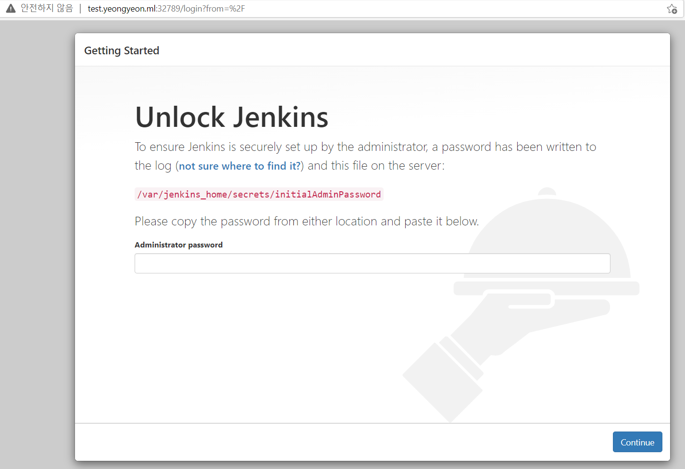
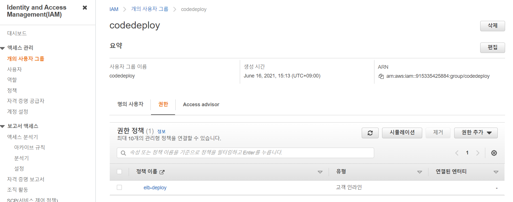
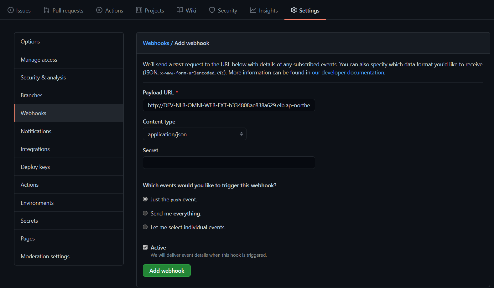

1. Application 구축

   

   * Spring boot (gradle) 생성 후 `"/"` 에 해당하는 핸들러 생성

   

   * 로드밸런서를 이용하여 CodeDeploy로 부터 배포 요청을 전달 받는 경우, Application이 최종적으로 잘 동작하는 지 확인하는 단계가 존재한다. </br>
     따라서 80 포트에서 app을 동작시키기 위한 application.properties 파일에 `server.port=80` 추가.

     

   * appspec.yml 작성 및 script 폴더 생성

     * CodeDeploy 에서 배포를 다르기 위해 필요한 파일로써, 배포 생명주기에 따라 파일을 특정 디렉토리로 옮기거나 Shell Script를 실행하도록 명령할 수 있다.
     * EC2 배포 기준 yaml 파일 이름은 반드시 `appspec.yml` 이어야 한다.
     * appspec.yml은 번들링한 파일 최상단(root)에 위치해야 한다.

   * 쉘 스크립트

     * deploy.sh

     ```shell
     #!/bin/bash
     BUILD_JAR=$(ls /home/ec2-user/jenkins/build/libs/*.jar)     # jar가 위치하는 곳
     JAR_NAME=$(basename $BUILD_JAR)
     echo "> build 파일명: $JAR_NAME" >> /home/ec2-user/deploy.log
     
     echo "> build 파일 복사" >> /home/ec2-user/deploy.log
     DEPLOY_PATH=/home/ec2-user/
     cp $BUILD_JAR $DEPLOY_PATH
     
     echo "> 현재 실행중인 애플리케이션 pid 확인" >> /home/ec2-user/deploy.log
     CURRENT_PID=$(pgrep -f $JAR_NAME)
     
     if [ -z $CURRENT_PID ]
     then
       echo "> 현재 구동중인 애플리케이션이 없으므로 종료하지 않습니다." >> /home/ec2-user/deploy.log
     else
       echo "> kill -15 $CURRENT_PID"
       kill -15 $CURRENT_PID
       sleep 5
     fi
     
     DEPLOY_JAR=$DEPLOY_PATH$JAR_NAME
     echo "> DEPLOY_JAR 배포"    >> /home/ec2-user/deploy.log
     nohup java -jar $DEPLOY_JAR >> /home/ec2-user/deploy.log 2>/home/ec2-user/deploy_err.log &
     ```

     * Git Repository 생성 후 연동

     

2. S3 버킷 생성

   * 통합 및 빌드된 Application과 appsepc.yml, 쉘 스크립트 들이 함께 번들링된 파일이 업로드 될 버킷.

3. EC2 생성

   https://okky.kr/article/884329

   젠킨스 프리티어에서 힘들어함 -> 메모리를 2GB 이상인 유형으로

4. Docker 설치

   ```shell
   sudo yum update -y
   sudo amazon-linux-extras install -y docker
   sudo service docker start
   sudo service docker enable?
   ```

5. Jenkins 설치

   ```shell
   sudo docker run -d --name jenkins -p 32789:8080 jenkins/jenkins:jdk11
   sudo docker ps
   ```

6. 보안그룹 및 리스너 추가

   Route 53을 사용해 test.yeongyeon.ml 레코드 이름으로 해당 NLB Domain을 라우팅 함.

   

   

   * 로드밸런서 리스너 추가 및 대상 그룹 등록

7. 접속 확인

   

   

   * `docker exec -it jenkins /bin/bash`

   * `cat /var/jenkins_home/secrets/initialAdminPassword`

   * Install suggested plugins 클릭.

   

   * Jenkins 관리 - 플러그인 관리

     `AWS CodeDeploy` 설치

     

8. 서버 구축

   * IAM 역할 생성 및 인스턴스 적용

     

   * Code Deploy Agent용 사용자 추가.

     * EC2가 Code Deploy 이벤트를 수신할 수 있도록 Agent를 설치해야한다. AWS CLI를 사용할 수 있도록, IAM 사용자를 하나 추가

     ```
     {
         "Version": "2012-10-17",
         "Statement": [
             {
                 "Effect": "Allow",
                 "Action": [
                     "autoscaling:*",
                     "codedeploy:*",
                     "ec2:*",
                     "lambda:*",
                     "elasticloadbalancing:*",
                     "s3:*",
                     "cloudwatch:*",
                     "logs:*",
                     "sns:*"
                 ],
                 "Resource": "*"
             }
         ]
     }
     ```

   * 사용자 추가 - 프로그래밍 방식 액세스, 그룹 설정 이후 .csv 다운로드

     

   * EC2에 JDK 11 및 Code Deploy Agent 설치

     ```shell
     sudo rpm --import https://yum.corretto.aws/corretto.key
     sudo curl -L -o /etc/yum.repos.d/coretto.repo 
     sudo yum install -y java-11-amazon-corretto-devel
     
     sudo yum -y update
     sudo yum install -y ruby
     cd /home/ec2-user
     curl -O https://aws-codedeploy-${REGION}.s3.amazonaws.com/latest/install
     sudo chmod +x ./install
     sudo ./install auto
     
     sudo yum install -y aws-cli
     sudo aws configure
     sudo service codedeploy-agent status
     ```

     

9. CodeDeploy 구축

   * 배포 구성 만들기
     * 배포 구성은 배포 과정에서 성공 실패 여부를 결정하는 규칙 셋을 의미한다.
     * 아래처럼 생성하면 배포과정에서 최소 1개의 인스턴스가 서비스 가능한 상태를 유지해야 한다.

   

   * 애플리케이션 생성

     

   * CodeDeploy Role 생성하여 배포 구성에 적용

     

     

     

     

10. Jenkins 프로젝트 생성

    * 새로운 code가 push 되었을 때, 이를 다운받아 테스트 및 빌드를 실행한 뒤 CodeDeploy 에게 배포 요청을 진행할 Jenkins 프로젝트 생성.

      

    * 소스 코드 관리

      * Repository 주소 및 branch 확인하여 기입

      

    * Github에 push 되었을 때 Github이 Jenkins에 hook을 날려 자동 빌드할 수 있도록 `Github hook Trigger` 선택

    * Build 부분에 jar 파일 만드는 `./gradlew clean build`  명령어 기입

      

    * 빌드 후 조치

      * Deploy an application to AWS CodeDeploy
        * 애플리케이션 이름
        * 그룹 이름
        * Region
        * Bucket
        * EC2에 배포할 파일들
        * accesskey, secretkey 설정

      

      

11. Github WebHook 추가

    * GIthub에 push 되었을 때 Jenkins로 Hook 날려 빌드가 실행되도록 하는 역할

      

      * Payload URL : `http://{DNS}:32789/github-webhook/`
      * Content type : `application/json`

12. 변경점을 만들어 새로 Push 해서 테스트

    

13. ㅁㄴㅇ

14. 


https://devlog-wjdrbs96.tistory.com/295

Developer -> Github -> EC2(docker+jenkins) -> s3 -> codedeploy -> server -> sns -> lambda -> slack

참고 사이트 : https://galid1.tistory.com/747?category=772172#%EA%B5%AC%EC%B6%95-%EC%A0%84-%ED%8C%81