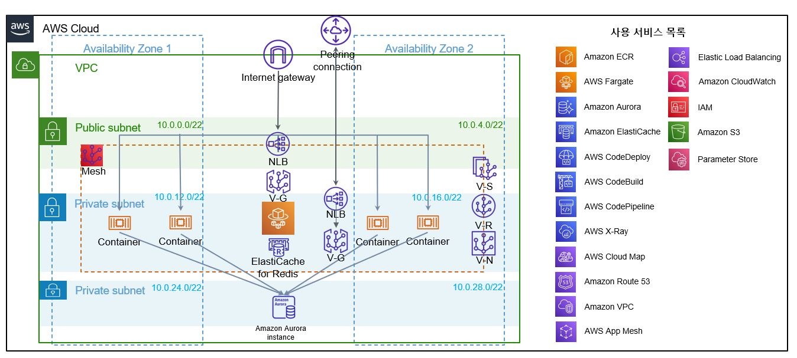
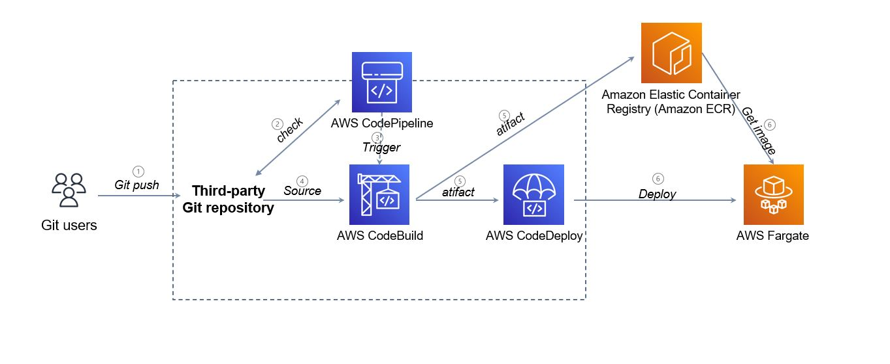
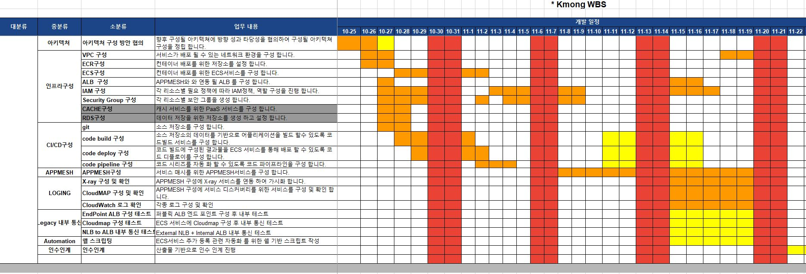

# Kmong Project

* 도전 과제 - 기존의 구조의 한계 및 고객사의 성장으로 인한 급격하게 증가하는 요구사항
  * 도메인 별로 분리할 수 있는 MSA 환경으로의 전환
  * 단시간(1개월) 내 MSA 개발 환경 구성 목표
  * 보다 클라우드 네이티브한 구성을 위한 베스트프렉티스 환경구성을 요청 받음
* 적용 방안
  * AWS Managed Service를 사용해야하는 상황으로 AWS App Mesh를 바탕으로 서비스 매시를 기반한 ECS 기반 MSA 전략을 사용
  * 기존 레거시 환경과 신규 MSA 환경 VPC를 분리하기 위해 내부 통신을 위한 피어링 설정이나 로드 밸런서 설정 등이 필요
  * AWS Code Series를 기반하여 CI/CD 전 과정을 App Mesh 기반으로 변경 적용 및 테스트(POC) 후 운영 환경에 적용
* 성과
  * 개발 인력들이 자신에게 부여된 개발 역할에만 집중할 수 있어 개발 주기가 30% 이상 빨라질 것으로 기대
  * 기존 모놀리식(Monolithic) 환경에서의 특정 API 서버가 부하가 걸릴 경우 전체 API 서버를 증설해야만 했는데, 이를 MSA로 전환함에 따라 부하가 걸린 API 서버만 증설하면 되기 때문에 비용 절감 효과 기대
  * 기존 환경 대비  새로운 MSA 환경에서 인프라 비용 50% 절감 기대

---

#### 아키텍처 (Dev)

#### Deploy flow

#### WBS

- 인프라 구축 및 인프라 생성 가이드 전달
- ECR 구성 자동화를 돕는 Shell Script 작성하여 전달