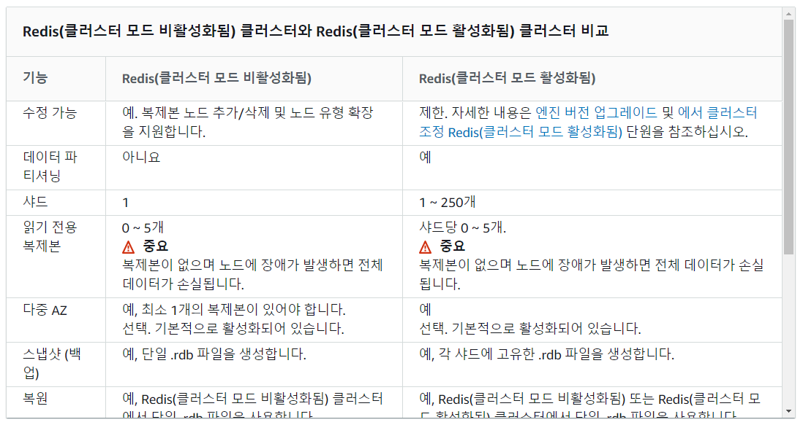
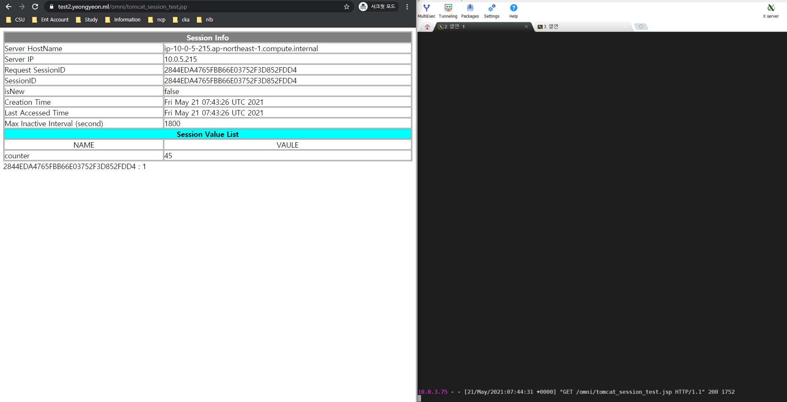
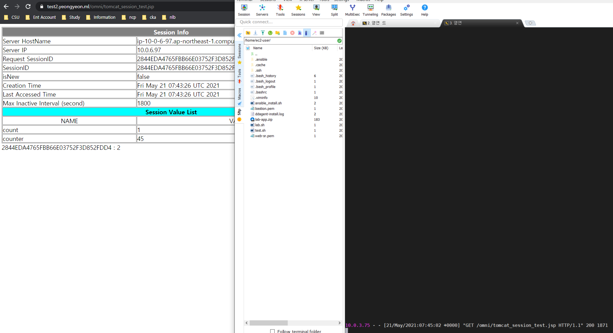

### Redis

* 클러스터 모드 비활성화 vs 클러스터 모드 활성화
  (https://docs.aws.amazon.com/ko_kr/AmazonElastiCache/latest/red-ug/Replication.Redis-RedisCluster.html)

  

* 비활성화 - '기본 엔드포인트' 사용
  활성화 - '구성 엔드포인트' 사용

### Redis & Tomcat Session Clustering

* Tomcat 서버 클러스터에 HTTP 요청을 쉽게 배포할 수 있도록 Redis에 세션을 저장합니다. 

* 여기서 세션은 고정되지 않으므로 각 요청은 클러스터의 모든 서버로 이동할 수 있음을 의미한다. 요청 세션은 다른 서버를 사용하기 위해 Redis 에 즉시 저장됩니다. 
* tomcat이 클라이언트로부터 요청을 받으면 세션이 Redis에서 직접로드됩니다.

참고 : https://github.com/ran-jit/tomcat-cluster-redis-session-manager


#### 1. Tomcat-cluster-redis-session-manager 설치

* `cd /usr/local/tomcat`
* `mkdir redis`
* `cd redis`

* `wget https://github.com/ran-jit/tomcat-cluster-redis-session-manager/releases/download/4.0/tomcat-cluster-redis-session-manager.zip`

* `unzip tomcat-cluster-redis-session-manager.zip`

* `cp tomcat-cluster-redis-session-manager/lib/* ../lib/`
* `cp tomcat-cluster-redis-session-manager/conf/* ../conf/`


* Redis Create


* Name 규칙상 _로는 생성이 안되므로 유의 (사진과 같이 만들 경우 오류 발생)


* redis-data-cache.properties 수정
  `vi /usr/local/tomcat/conf/redis-data-cache.properties`
  redis.hosts= <ElastiCache-Endpoint.cache.amazonaws.com>:6379
  WAS 1과 2의 세션을 공유하고 싶다면 같은 노드를 사용해야한다. ☆

* web.xml `<session-config>` 설정 확인

* context.xml 수정

  `vi /usr/local/tomcat/conf/context.xml`

  ```xml
  <Context> # Context 안에 아래 두 줄 삽입
  --
  
      <Valve className="tomcat.request.session.redis.SessionHandlerValve" />
      <Manager className="tomcat.request.session.redis.SessionManager" />
  
  --
  </Context>
  ```

* 테스트 페이지 jsp 생성
  `vi /usr/local/tomcat/webapps/omni/tomcat_session_test.jsp`

  ````jsp
  <%@ page language="java" contentType="text/html; charset=UTF-8"
          pageEncoding="UTF-8"%>
  <%@ page import="java.text.*"%>
  <%@ page import="java.util.*"%>
  <%
          String RsessionId = request.getRequestedSessionId();
          String sessionId = session.getId();
          boolean isNew = session.isNew();
          long creationTime = session.getCreationTime();
          long lastAccessedTime = session.getLastAccessedTime();
          int maxInactiveInterval = session.getMaxInactiveInterval();
          Enumeration e = session.getAttributeNames();
  %>
  <html>
  <head>
  <meta http-equiv="Content-Type" content="text/html; charset=EUC-KR">
  <title>Session Test</title>
  </head>
  <body>
  <table border=1 bordercolor="gray" cellspacing=1 cellpadding=0
          width="100%">
          <tr bgcolor="gray">
                  <td colspan=2 align="center"><font color="white"><b>Session
                  Info</b></font></td>
          </tr>
          <tr>
                  <td>Server HostName</td>
                  <td><%=java.net.InetAddress.getLocalHost().getHostName()%></td>
          </tr>
          <tr>
                  <td>Server IP</td>
                  <td><%=java.net.InetAddress.getLocalHost()
                                                                          .getHostAddress()%></td>
          </tr>
          <tr>
                  <td>Request SessionID</td>
                  <td><%=RsessionId%></td>
          </tr>
          <tr>
                  <td>SessionID</td>
                  <td><%=sessionId%></td>
          </tr>
          <tr>
                  <td>isNew</td>
                  <td><%=isNew%></td>
          </tr>
          <tr>
                  <td>Creation Time</td>
                  <td><%=new Date(creationTime)%></td>
          </tr>
          <tr>
                  <td>Last Accessed Time</td>
                  <td><%=new Date(lastAccessedTime)%></td>
          </tr>
          <tr>
                  <td>Max Inactive Interval (second)</td>
                  <td><%=maxInactiveInterval%></td>
          </tr>
          <tr bgcolor="cyan">
                  <td colspan=2 align="center"><b>Session Value List</b></td>
          </tr>
          <tr>
                  <td align="center">NAME</td>
                  <td align="center">VAULE</td>
          </tr>
          <%
                  String name = null;
                  while (e.hasMoreElements()) {
                          name = (String) e.nextElement();
          %>
          <tr>
                  <td align="left"><%=name%></td>
                  <td align="left"><%=session.getAttribute(name)%></td>
          </tr>
          <%
                  }
          %>
  
  
  </table>
  
          <%
  
                  int count = 0;
  
                  if(session.getAttribute("count") != null)
                          count = (Integer) session.getAttribute("count");
  
                  count += 1;
  
                  session.setAttribute("count", count);
  
                  out.println(session.getId() + "     :     " + count);
          %>
  </body>
  </html>
  
  ````

* `systemctl restart tomcat`

* WAS-A 서버 Session Test

  

* WAS-C 서버 Session Test

  

* Server IP는 변경되지만, SessionID는 변하지 않음으로 세션 공유를 확인
  사진 우측은 각 WAS 서버에서 access log를 확인
