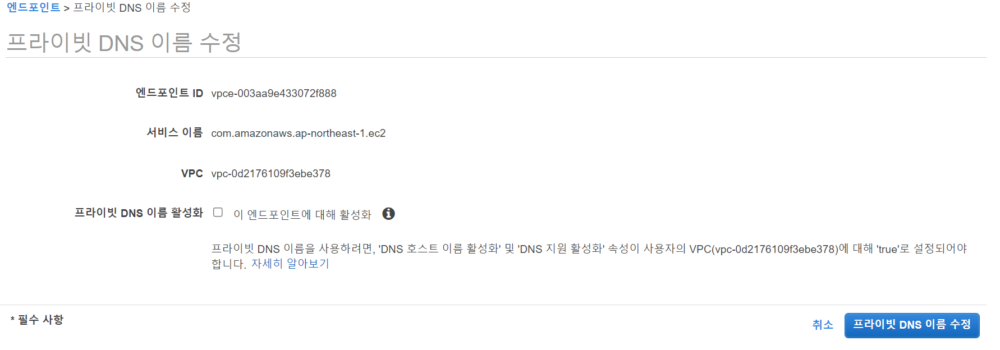
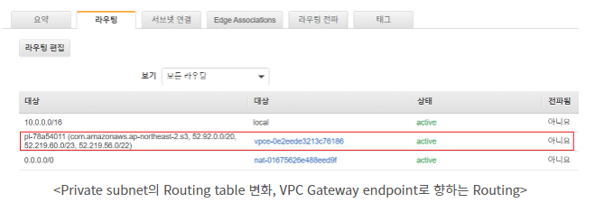

#### **VPC** 

AWS 리소스를 시작할 수 있는 가상 네트워크.

* - On-premise(전통적인 인프라)와 동일한 대역의 사설 IP를 사용할 수 있지만. 
    /16 ~ /28 대역 제한이 존재.
  - 10.0.1.0~3, 255는 AWS 관리 IP로서 사용자가 사용할 수 없는 AWS의 예약 주소이다.
  
  * 서브넷 : VPC의 IP 주소 범위 (인터넷 연결되어야하는 리소스에는 퍼블릭 서브넷, 그렇지 않은 리소스엔 프라이빗)
  * 라우팅 테이블 : 네트워크 트래픽을 전달할 위치를 결정하는 데 사용하는 라우팅 규칙 집합.
    * Destination : 트래픽을 이동할 대상 IP 주소의 범위
    * Target : 대상 트래픽을 전송할 때 사용할 게이트웨이, 네트워크 인터페이스 또는 연결
  * 인터넷 게이트웨이 : VPC의 리소스와 인터넷 간의 통신을 활성화하기 위해 VPC에 연결하는 게이트웨이
  
* **VPC EndPoint(Interface endpoint & Gateway endpoint)**

  * AWS VPC는 사설 네트워크로 이루어진 사용자 정의 네트워크로 VPC 내 EC2, RDS, ELB 등을 탑재하고 ENL(Elastic Network Interface)에 사설 IP 혹은 공인 IP를 부여하여 사용하는 것.
    반면에, Cloudwatch, Cloudfront, Dynamo DB, API Gateway 등은 VPC 내부에 탑재하여 사용하는 서비스가 아니다. AWS의 Region 내에 존재하는 것은 사실이지만 VPC 내부에 존재하지 않고 공인 IP를 가지고 외부에서 접근하는 서비스들이다. 
    **한마디로, VPC 내부의 Resource들이 S3와 같은 서비스를 이용하기 위해서는 외부 인터넷을 통해 도달해야 한다.**
    -> S3 bucket에 대해 `nslookup` 할 경우 공인 IP를 반환한다. 즉 S3는 공인 IP를 보유하고 있으며 인터넷을 통해서 접근할 수 있는 서비스임을 뜻 한다.
    (EC2 -> NAT Gateway -> Internet Gateway -> 외부 인터넷 -> S3)
  * 위와 같은 경로를 통해 S3 bucket에 도착하면 트래픽이 외부에 노출되어 보안상 좋지 않다.
    따라서, VPC EndPoint를 사용한다.
  * 인터넷게이트워이, NAT 디바이스, VPN 연결 또는 AWS Direct Connect 연결을 필요로 하지 않고 AWS PrivateLink 구동 지원 AWS 서비스 및 VPC 엔드포인트 서비스에 비공개로 연결할 수 있다.
    -> 외부 AWS 서비스와 통신 시 Public IP를 필요로 하지 않는다.

* **Interface Endpoint**

  

  

  * 위의 사진을 참고하여 아래처럼 실제로 VPC에서 구성해보았다.

  

  * 엔드포인트를 생성 후 '프라이빗 DNS 이름 활성화' 비활성화 할 경우

  

  * 위와 같이 여전히 공인 IP를 통한 접근을 하게 된다.

    

  

  * '프라이빗 DNS 이름 활성화' 활성화 후 `nslookup` 커맨드 시 정상적으로 EndPoint를 통해 접근

  * EC2 API endpoint에 도달하기 위한 방법의 차이.
    * 초록색 : Interface endPoint 생성 전 외부 인터넷을(공인 IP)  통해 도달하는 모습
    * 파란색 : Interface endPoint 생성 후 EndPoint network Interface를 (사설 IP) 통해 도달하는 모습
  * **DNS 이름**을 목적지로 설정하여야 한다. 
    => Private DNS names enabled 반드시 활성화 해야 공인 IP 주소가 아닌 DNS가 EndPoint network interface 주소를 불러온다.

* **Gateway Endpoint**

  * S3, Dynamo DB를 위한 Endpoint인 Gateway endpoint는 Interface endpoint와 달리 인터페이스가 추가되지 않음.
  * 대신 VPC Gateway Endpoint로 향하는 Private subnet의 Routing table에 Routing이 자동으로 추가된다.

  

  * 이후 해당 S3 Bucket의 공인 IP인 (52.219.60 or 56.0/?) 에 `traceroute` 명령어로 확인 시 NAT Gateway로 나간 흔적이 보이지 않음 -> 공인 IP를 타지 않는다.
  * `/aws s3 ls` 명령어를 통해 기능이 제대로 작동하는지 확인.

---

* 

* *사진/내용 참조 (https://aws-hyoh.tistory.com/entry/VPC%EC%99%80-Network-%EC%89%BD%EA%B2%8C-%EC%9D%B4%ED%95%B4%ED%95%98%EA%B8%B0-5?category=768982)*
