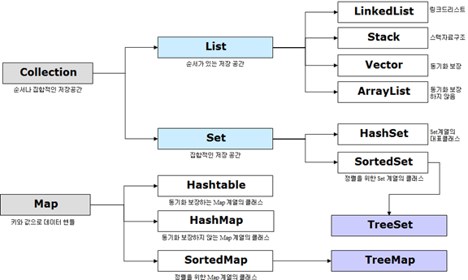

##### Java에서 컬렉션이란 데이터의 집합 그룹을 의미

* Collections Framework의 상속 구조

##### Collection 인터페이스의 특징

| 인터페이스 | 구현클래스                            | 특징                                                         |
| ---------- | ------------------------------------- | ------------------------------------------------------------ |
| Set        | HashSet TreeSet                  | 순서가 없는 데이터의 집합, 중복 X                            |
| List       | LinkedList Vector ArrayList | 순서가 있는 데이터의 집합, 중복 O                            |
| Queue      | LinkedList PriorityQueue         | List와 유사                                                  |
| Map        | Hashtable HashMap TreeMap   | 키(Key), 값(Value)의 쌍으로 이루어진 데이터의 집합. 순서가 없으며 키(Key)의 중복 X, 값(Value)의 중복 O |

