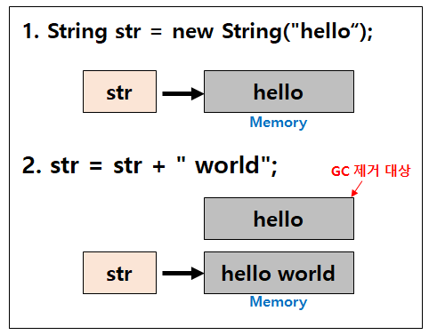

#### String vs StringBuffer/StringBuilder

##### String

* String은 불변성(immutable)이다.

* String 클래스의 참조변수 `str`이 "hello world"라는 값을 가지고 있는 **새로운 메모리 영역**을 가리키게 되고, 처음 선언했던 "hello" 값이 할당되어 있던 메모리 영역은 Garbage로 남아있다가 GC(Garbage Collection)에 의해 사라지게 되는 것. 새로운 String 인스턴스가 생성되는 것이다.
* 문자열 추가, 수정, 삭제 등의 연산이 빈번하게 발생하는 경우 String 클래스를 사용하면 힙 메모리에 많은 임시 Garbage가 생성되어 애플리케이션에 영향을 주게 된다. 이를 해결하기 위해 가변성을 가지는 StringBuffer/StringBuilder 클래스를 도입.

##### StringBuffer/StringBuilder

* `.append()` 등의 메서드를 이용하여 동일 객체내에서 문자열을 변경하는 것이 가능하다. (주소 값을 확인해보면 변경 전, 후 주소 값이 같음)
* StringBuffer vs StringBuilder
  * 동기화의 유뮤에서 차이가 난다.
  * StringBuffer는 동기화 키워드를 지원하여 멀티스레드 환경에서 안전하고,
    String 또한 불변성을 가지기 때문에 마찬가지로 멀티스레드 환경에서 안전하다.

##### [정리]

**String**: 불변성, 문자열 연산이 적은 멀티스레드 환경에 적합

**StringBuffer**: 가변성, 멀티스레드 환경에서 적합

**StringBuilder**: 가변성, 단일스레드 환경에서 적합