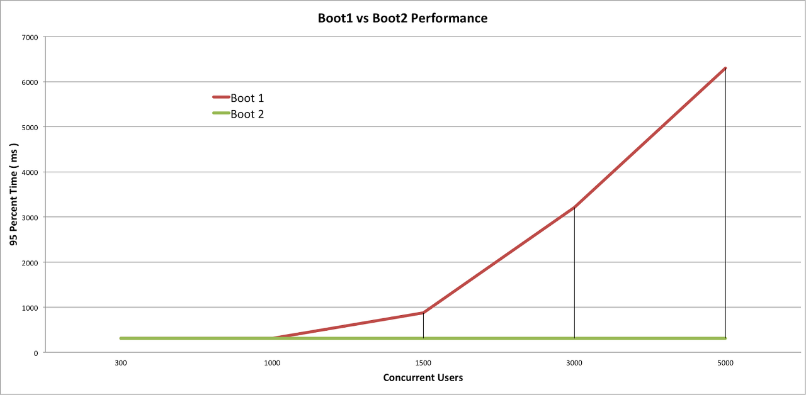

##### RestTemplate

* 복잡한 HttpClient 사용을 한번 추상화한 객체로써 단순 메소드 호출만으로 쉽게 HTTP 요청을 주고 받을 수 있도록 도와준다

##### TestRestTemplate

* REST 방식으로 개발한 API Test를 최적화하기 위한 클래스

##### RestTemplate 특징

* RESTful
* 멀티쓰레드 방식
* Thread Safe
  * 따라서, 경쟁 상태가 발생하지 않아서 전역변수로 사용해도 된다. 

* Blocking 방식

##### RestTemplate 작동 순서

ㅇㅣㅁㅣㅈㅣ

1. 어플리케이션이 RestTemplate를 생성하고, URI, HTTP메소드 등의 헤더를 담아 요청한다.
2. RestTemplate 는 HttpMessageConverter 를 사용하여 requestEntity 를 요청메세지로 변환한다.
3. RestTemplate 는 ClientHttpRequestFactory 로 부터 ClientHttpRequest 를 가져와서 요청을 보낸다.
4. ClientHttpRequest 는 요청메세지를 만들어 HTTP 프로토콜을 통해 서버와 통신한다.
5. RestTemplate 는 ResponseErrorHandler 로 오류를 확인하고 있다면 처리로직을 태운다.
6. ResponseErrorHandler 는 오류가 있다면 ClientHttpResponse 에서 응답데이터를 가져와서 처리한다.
7. RestTemplate 는 HttpMessageConverter 를 이용해서 응답메세지를 java object(Class responseType) 로 변환한다.
8. 어플리케이션에 반환된다.
   

##### RestTemplate Connection issue

* RestTemplate은 호출할 때마다, 로컬에서 임시 TCP 소켓을 개방하여 사용한다. 이렇게 사용된 TCP 소켓은 TIME_WAIT 상태가 되는데, 요청량이 많아진다면 TIME_WAIT 상태의 소켓들은 재사용 될 수 없기 때문에 응답에 지연이 생길 수 있다. 
* 이러한 응답 지연 상황을 대비하여 DB가 Connection Pool을 이용하듯이 RestTemplate도 Connection Pool을 이용할 수 있다. 그러기 위해선 RestTemplate 내부 구성을 설정해야 한다.
  * 단, 호출하는 API 서버가 Keep-Alive를 지원해야 한다. 
    * 대상 서버가 Keep-Alive를 지원하지 않으면, 미리 Connection Pool을 만들어 놓지 못하고 요청마다 새로운 Connection이 연결되어 매번 handshake가 발생되어 RestTemplate의 Connection Pool을 위한 내부 설정이 의미가 없어지기 때문.

```java
@Configuration
public Class RestTemplateConfig {
    @Bean
    HttpClient httpClient() {
        return HttpClientBuilder.create()
            .setMaxConnTotal(10) // 최대 Connection 수
            .setMaxConnPerRoute(2) // 
            .build();
    }
}
```

* 

---

##### WebClient

* 스프링 5.0 에서 추가된 인터페이스.
* webflux 의존성을 추가해야 한다.

##### WebClient 특징

* JSON, XML 응답을 쉽게 받는다.

* 싱글쓰레드 방식
* Non-Blocking 방식

##### WebClient 생성

* 


https://alwayspr.tistory.com/44 참고




