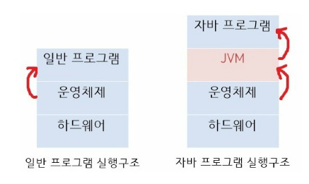

#### Java에서 Static 사용을 지양해야하는 이유?

> 캡슐화, 재사용성 등의 측면에서 OOP 특징과 맞지 않아서.

* 객체 지향적이지 않다.
  * static은 전역 변수를 사용할 때 유용하다. 하지만 객체 지향 프로그래밍(OOP) 원칙에 따르면, 한 객체가 지닌 데이터는 외부에서 접근하여 수정할 수 없도록 해야함. **캡슐화** 원칙에 위반된다.
* 재사용성이 떨어진다.
  * static 메서드는 `interface` 구현하는데 사용될 수 없다. -> 객체지향적 설계에 방해될 수 있다.

---

#### 시간복잡도란?

* 문제를 해결하는데 걸리는 시간과 입력의 함수 관계

* 빅-오 표기법을 사용하여 나타내며, 계수와 낮은 차수의 항을 제외시키는 방법이다.

  e.g. 크기 n의 모든 입력에 대한 알고리즘에 필요한 시간이 최대 `5n^3 + 3n`의 식을 가진다면, 이 알고리즘의 점진적 시간 복잡도는 `O(n^3)` 이라고 할 수 있다.

---

#### 멀티 프로세스로 할 수 있는 작업을 하나의 프로세스에서 스레드로 나눠가며 하는 이유

* OS가 시스템 자원을 효율적으로 관리하기 위해 스레드를 사용한다.
* 멀티 프로세스로 실행되는 작업을 멀티 스레드로 실행할 경우, 프로세스를 생성하여 자원을 할당하는 **시스템 콜**이 줄어들어 자원을 효율적으로 관리할 수 잇다.
* 프로세스 간의 통신보다 스레드 간의 통신 비용이 적으므로 부담이 줄어든다.

---

#### Java가 실행되는 과정

1. `.java` 소스코드를 javac라는 컴파일러가 컴퓨터가 이해할 수 있도록 기계어로 변경하기 위해 `.class` 바이트 코드로 변환한다. 
2. JVM을 구동시켜 `.class` 바이트 코드를 해석하여 자바 프로그램이 실행된다.

-> 바이트 코드는 JVM이 이해할 수 있는 언어로 변환된 코드로, JVM만 설치되어 있다면 어떤 운영체제에서라도 실행될 수 있다.

* 일반 프로그램은 OS가 프로그램을 실행시킨다. 반면 자바 프로그램은 운영체제가 JVM을 실행시키면 JVM이 `.class` 파일을 해석하여 자바 프로그램을 실행시킨다.

##### JVM

* `.class` 파일을 읽어 자바 프로그램을 실행함
* GC(Garbage Collection)을 수행한다.

---

