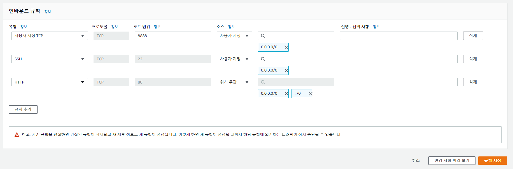
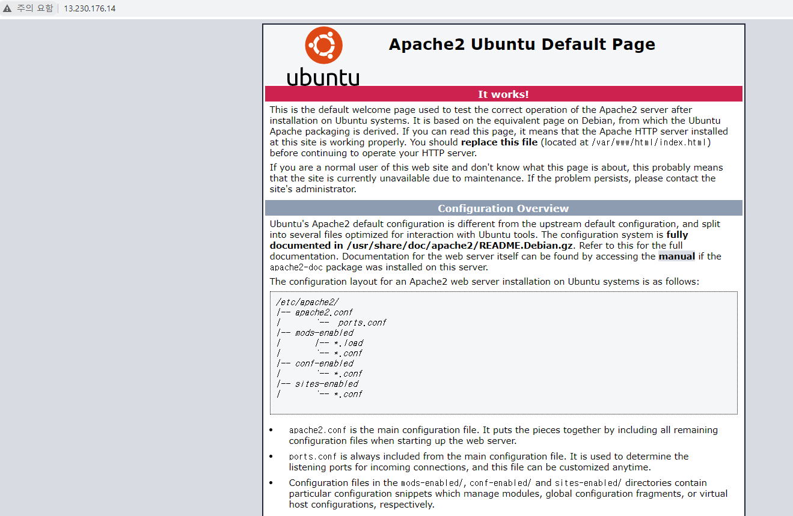

### AWS EC2에 도커(Docker) 설치

``` $ sudo apt update ``` </hr>

``` $ sudo apt install apt-transport-https ``` </hr>

``` $ sudo apt install ca-certificates ```</hr>

``` $ sudo apt install curl ``` - 특정 웹사이트에서 데이터 다운로드 받을 때 사용</hr>

``` $ sudo apt install software-properties-common ```</hr>

``` $ curl -fsSL https://download.docker.com/linux/ubuntu/gpg | sudo apt-key add - ``` </hr>

``` $ sudo add-apt-repository "deb [arch=amd64] https://download.docker.com/linux/ubuntu bionic stable" ```</hr>

``` $ sudo apt update ```</hr>

``` $ apt-cache policy docker-ce ``` </hr>

``` $ sudo apt install docker-ce ``` </hr>

---

### Dockerfile로 웹 서버 구동시키기

* Dockerfile 생성.

``` 
$ cd /home/ubuntu
$ ls
$ mkdir example
$ cd example
$ sudo vi Dockerfile
```

* Dockerfile 작성.

```
FROM ubuntu:18.04
MAINTAINER YeongYeon Kim <dudtbd111@naver.com>

RUN apt-get update
RUN apt-get install -y apache2 # Install Apache web server (Only 'yes')

EXPOSE 80 # Open HTTP Port

CMD ["apachectl", "-D", "FOREGROUND"]
```

* Docker 이미지 만들기 & 이미지 확인.

``` 
$ docker build -t example .
$ docker images
```


* 위 처럼 Dockerfile을 만들면 EXPOSE 오류가 난다. </br>
  Build에 문제가 있으면 이런식으로 문제를 보고 수정하면 된다.
  * **EXPOSE**에선 주석을 허용하지 않기 때문에 주석을 삭제해준다.


```
$ docker run -p 80:80 example
(우리 서버의 포트 : 컨테이너의 포트)
```




* 보안 그룹 - 인바운드 규칙 추가.



* 웹 서버를 구동.

