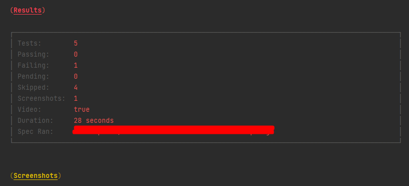
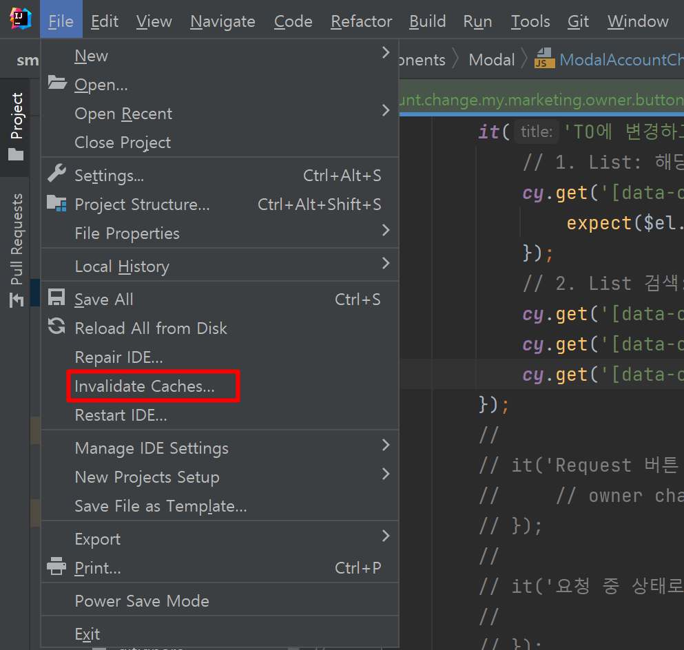

[공식 문서](https://docs.cypress.io/guides)

먼저 npm install 등 필요한 환경 설정들을 해준다.

##### 전체 테스트

* 서버 터미널에서 `npm run cypress` 명령어로 실행

##### 특정 테스트

* `cypress open` 명령어로 cypress 앱을 실행시켜서 좀 더 편한 UI 에서 작업이 가능 ([Cypress App](https://docs.cypress.io/guides/core-concepts/cypress-app))

* `cypress run --spec 'path/to/files/*.spec.js'` 경로를 기입하여 테스트 가능

```javascript
// cypress.json
describe('My Account', function () {
    context('Result', function () {
        before(() => {
            // cy.login();
            cy.login('yeongyeon.kim@bespinglobal.com', '1q2w3e4r!!');
        });
    });
});
```

##### Selector Playground

* Cypress URL 왼쪽의 버튼을 클릭하면 요소에 대한 selector가 Console에 나타난다.
  ([참고](https://docs.cypress.io/guides/core-concepts/cypress-app#Finding-Selectors))

---

##### cy.get

* 태그 안쪽: `data-cy={'name'}`
* cypress.json 안쪽: `[data-cy=name]`

```javascript
// 가져오고자 하는 데이터가 있는 <Button> 태그
<Button data-cy={'name'}> </Button>
```

```javascript
// cypress.json
it('my name', () => {
	cy.get('[data-cy="name"]').click({force: true});
});
```

```javascript
// ok 버튼, cancel 버튼 공통 함수 만들기
class SwalPopup {
    confirm() {
        return cy.get('.swal2-confirm').click();
    }
    cancel() {
        return cy.get('.swal2-cancel').click();
    }
}

export default new SwalPopup();
```

* 작성 시 role은 카멜 방식이 아닌 '-' 사용

* 참고할만한 사이트 (https://example.cypress.io/)
  * `.type()`: 문자열을 입력한다.

```json
cy.get('.class-name')
  .type('dudtbd111@naver.com')
  .should('have.value', 'dudtbd111@naver.com');
// cy.get 해당 클래스 태그가 있는 요소를 선택한다.
// 'dudtbd111@naver.com' 이란 문자열을 입력한다.
// should 함수를 통해, `dudtbd111@naver.com` 문자열을 값으로 가지고 잇는지 확인

cy.url(); // 현재 url을 가져올 수 있다.
cy.url().should('be.visible');
```

* cy.get은 text() 기능이 없어서 `should('have.text', )` 를 사용하여 값의 유무를 알 수 있다.

```javascript
cy.get('[data-cy="tooltip"]').should('have.text', 'e2e MO');
```

* cy.get 안에서 `>`의 활용법

```
            cy.get('[data-cy="listMngArea"] .MuiTableBody-root > tr').eq(2).each(($el, idx) => {
                cy.log($el.children().eq(1).text());
                // cy.log($el.children().eq(2).text());
                cy.log($el.children().eq(2).children().eq(0).text());
            })

/*
	특정 Table (listMngArea 클래스가 있는)에 TableRow 3개와 각 TableRow안에는 TableCell이 4개가 있는데 Cell마다 속성이 달라서
	데이터를 조회하기 원하는 .MuiTableBody-root > tr eq(2) - 3번째 테이블의 요소들을 
	직접 불러온 뒤, 2번째 Cell과 3번째 Cell의 Children 값을 조회
	
*/
```

---

##### Wait

1. 비동기 api를 사용할 때 불러오는 동안 아래의 코드가 실행되서 요소를 못 찾을 수 있으므로 wait를 사용한다.

```javascript
cy.wait();
// api의 결과를 별칭으로 지정 후 해당 별칭을 실행하고 싶은 순서대로 인자를 넣어줄 수도 있음 
```

2. 비동기 api가 순서가 있는 경우 다음과 같이 wait에 순서를 걸어둠 (interception[0]과 [1]이 됨)

```javascript
cy.intercept('POST', `/api/path`).as('postApi');
cy.intercept('GET', `/api/path`).as('getApi');
cy.wait(3000);
cy.wait('@PostApi', '@getApi').then((interception) => {
	// interception[0], interception[1]
});
```

---

### ETC

##### front, cypress 개발 중 intellij 가 느려진 경우 clean up + cache clean

1. `package.json` 안에 아래와 같이 cleanup 사용

```json
"scripts": {
	"cleanup": "rimraf target/classes/static/",
}
```

2. File -> Invalidate Caches...


