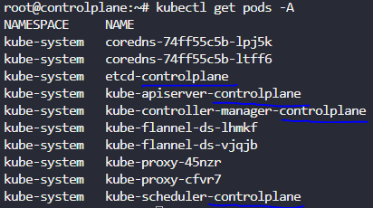
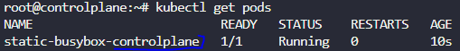

##### 노드에 포드 할당

```yaml
# https://kubernetes.io/docs/concepts/scheduling-eviction/assign-pod-node/
apiVersion: v1
kind: Pod
metadata:
  name: nginx
spec:
  nodeName: node01
  containers:
  -  image: nginx
     name: nginx
```

##### 파라미터 key, value 구문

```shell
# How many objects are in the prod environment including PODs, ReplicaSets and any other objects?
kubectl get all --selector env=prod,bu=finance,tier=frontend
```

##### Taint, Toleration

* 테인트와 톨러레이션은 함께 작동하여 파드가 부적절한 노드에 스케줄되지 않게 한다.
* 노드에 테인트를 배치하고 톨러레이션은 파드에 적용된다.

```shell
# https://kubernetes.io/docs/concepts/scheduling-eviction/taint-and-toleration/
# Create a taint on node01 with key of spray, value of mortein and effect of NoSchedule
kubectl taint nodes node01 spray=mortein:NoSchedule
```

##### Node Affinity (node, pod에 따라 spec 안의 affinity 파라미터 값이 많이 달라짐)

```shell
# https://kubernetes.io/docs/tasks/configure-pod-container/assign-pods-nodes-using-node-affinity/
# Apply a label color=blue to node node01
kubectl label nodes node01 color=blue

# 노드
# https://kubernetes.io/docs/tasks/configure-pod-container/assign-pods-nodes-using-node-affinity/#schedule-a-pod-using-required-node-affinity
 
# 파드
# https://kubernetes.io/docs/concepts/scheduling-eviction/assign-pod-node/
```

```shell
# Create a new deployment named red with the nginx image and 2 replicas, and ensure it gets placed on the controlplane node only. 
# Use the label - node-role.kubernetes.io/master - set on the controlplane node.

kubectl create deploy red --image=nginx --replicas=2 --dry-run -o yaml > red.yaml
```

```yaml
# red.yaml
# # 표시 한 것들 위주로 수정
apiVersion: apps/v1 #
kind: Deployment #
metadata:
  creationTimestamp: null
  labels:
    app: red
  name: red
spec:
  replicas: 2
  selector:
    matchLabels:
      app: red
  strategy: {}
  template:
    metadata:
      creationTimestamp: null
      labels:
        app: red
    spec:
      containers:
      - image: nginx
        name: nginx
        resources: {}
      affinity:
        nodeAffinity: #
          requiredDuringSchedulingIgnoredDuringExecution: #
            nodeSelectorTerms: #
            - matchExpressions:
              - key: node-role.kubernetes.io/master
                operator: Exists
                #operator가 Exists가 아닌 in이면 필요한 요소가 더 있음.
```

##### Resource Limits

* CrashLoopBackOff 상태는 포드의 메모리가 부족하여 실패했음을 나타냅니다. POD에 설정된 메모리 제한을 식별합니다.
* CrashLoopBackOff 상태인 경우 `logs` 혹은 `describe` 로 상태를 확인하여 문제를 해결.

##### DaemonSets

* kubectl create deployment 를 생성하고 `replicas` 부분을 삭제하고 `kind`를 DaemonSet 으로 바꾸어 주면 된다.

##### Static Pod

* 정적 포드는 API 서버가 아닌 특정 노드의 kubelet 데몬이 만들고 관리하는 포드. 정적 포드가 충돌하면 kubelet이 이를 다시 시작한다.

* 컨트롤 플레인 에 해당하는 서비스는 스케줄러가 아닌 정적 포드 형태로 배포가 된다. 
* 따라서, kubelet 구성 파일에 `staticPodPath: <the directory` 필드가 존재한다.</br>
  `ps -ef | grep kubelet` 으로 정적 포드 정의 파일 디렉토리를 확인.



* 기본적으로 정적 포드는 컨트롤 플레인 구성 요소에 대해 생성되므로 컨트롤 플레인 노드에서만 생성된다. 

* 정적포드의 생성

  ```shell
  # /etc/kubernetes/manifests 와 같이 매니페스트 디렉토리에 yaml을 배치하고 create 해야한다.
  kubectl run --image=busybox static-busybox --dry-run=client -o yaml --command -- sleep 1000 > /etc/kubernetes/manifests/static-busybox.yaml
  ```

  

---

##### Rolling Update and RollBack

* 파드 인스턴스를 점진적으로 새로운 것으로 업데이트하여 디플로이먼트 업데이트가 서비스 중단 없이 이루어질 수 있도록 해준다. 새로운 파드는 가용한 자원을 보유한 노드로 스케줄 될 것이다.
* 디플로이먼트가 외부로 노출되면, 서비스는 업데이트가 이루어지는 동안 오직 가용한 파드에게만 트래픽을 로드밸런스 할 것이다.

```shell
kubectl edit deployment <deploy-name>
```

**Commands and Arguments**

```shell
kubectl run ubuntu-sleeper-2 --image=ubuntu -o yaml --command -- sleep 5000 > ubuntu-sleeper-2.yaml
```

##### ConfigMap

```shell
kubectl create configmap webapp-config-map --from-literal=APP_COLOR=darkblue
# --from-file --from-literal
```

##### Multi Container pods

```yaml
# https://kubernetes.io/docs/concepts/workloads/pods/init-containers/#init-containers-in-use
apiVersion: v1
kind: Pod
metadata:
  name: myapp-pod
  labels:
    app: myapp
spec:
  containers:
  - name: myapp-container
    image: busybox:1.28
    command: ['sh', '-c', 'echo The app is running! && sleep 3600']
   
  - name: abc
    image: def
    command: ['sleep 20']
    # command는 위 아래 형식 둘 다 가능하다.
    command: 
      - "sleep"
      - "20"
  initContainers:
  - name: init-myservice
    image: busybox:1.28
```

* Pod 내의 로그 파일 확인하는 법

`kubectl exec -it <pod> -n <namespace> -- cat <log_path>`

---

##### OS Upgrade

```shell
kubectl get po -o wide # -> node01
# node01 업그레이드를 하기 위해서 해당 노드에 연결되어 있는 포드의 스케줄을 다른 노드로 되게끔 해야한다. 
# daemonset 을 무시하고, db 데이터와 같은 로컬 데이터를 삭제 후 진행
kubectl drain node01 --ignore-daemonsets --delete-local-data
kubectl get po -o wide # -> controlplane # controlplane에 taint가 없기 때문
# node01에 스케줄이 되도록 uncordon
kubectl uncordon node01
```

##### Cluster Upgrade Process

```shell
# https://v1-20.docs.kubernetes.io/docs/tasks/administer-cluster/kubeadm/kubeadm-upgrade/
# Control plane 1.19.0 -> 1.20.0
kubectl drain controlplane --ignore-daemonsets
apt-get update
apt install kubeadm=1.20.0-00
kubeadm upgrade apply v1.20.0
apt install kubelet=1.20.0-00
sudo systemctl daemon-reload
sudo systemctl restart kubelet
kubectl uncordon controlplane
# Worker node 동일
```

##### Backup and Restore Methods

```
```

