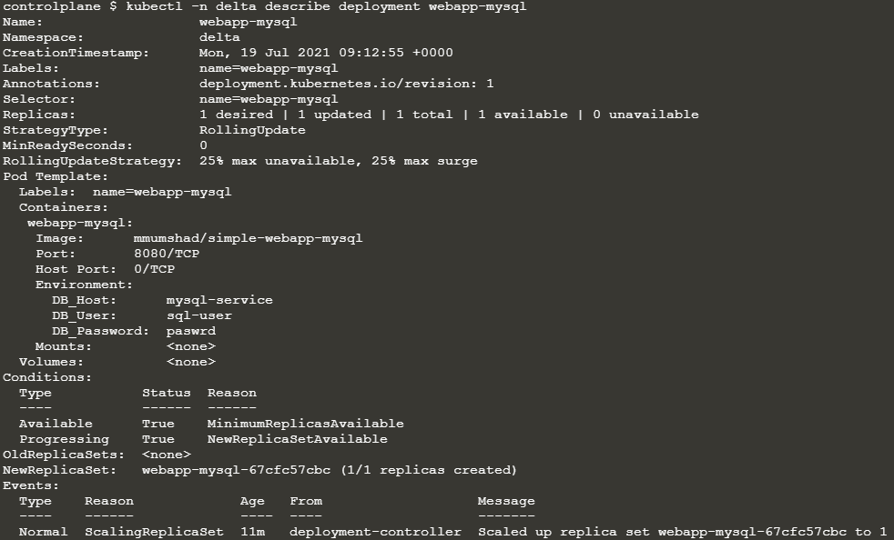

##### Web, DB 2 tier로 구성된 애플리케이션을 예시

[Troubleshoot Applications | Kubernetes](https://kubernetes.io/docs/tasks/debug-application-cluster/debug-application/)

1. 접근 가능성 여부 확인
   
   `curl http://web-service-ip:node-port`

2. 서비스 상태 확인
   
   `kubectl describe service web-service`

3. Pod 확인 (Web, DB 모두)
   
   `kubectl get pod`
   
   `kubectl describe pod <service-pod-name>`
   
   `kubectl logs <service-pod-name> -f --previous`

---

Q) **Troubleshooting Test 1:** A simple 2 tier application is deployed in the `alpha` namespace. It must display a green web page on success. Click on the app tab at the top of your terminal to view your application. It is currently failed. Troubleshoot and fix the issue.

Stick to the given architecture. Use the same names and port numbers as given in the below architecture diagram. Feel free to edit, delete or recreate objects as necessary.


A)

```shell
kubectl -n alpha get all # 서비스 이름이 잘못되어있는것을 확인함.
kubectl -n alpha get svc mysql -o yaml > mysql-service.yaml
kubectl -n alpha alpha delete svc mysql
vi mysql-service.yaml # metadata 이름 변경 mysql -> mysql-service
```

---

Q) **Troubleshooting Test 2:** The same 2 tier application is deployed in the `beta` namespace. </br>이하 1번 문제와 동일

A)


```shell
kubectl -n alpha get all
kubectl -n alpha get svc mysql
kubectl describe svc mysql-service -n beta # 위 아키텍처와 다름. Targetport
```

---

Q) **Troubleshooting Test 3:** The same 2 tier application is deployed in the `gamma` namespace. </br>이하 1번 문제와 동일

A) 

```shell
kubectl -n gamma get ep # 엔드포인트 확인
# 혹은 kubectl describe svc <service-name> -n gamma
```


`kubectl -n gamma expose pod mysql --name=mysql-service`

---

Q) **Troubleshooting Test 4:** The same 2 tier application is deployed in the `delta` namespace.


A)



user가 잘못됨을 확인

---

이후 동일하게 mysql pod의 user 혹은 password 변수가 잘못되어있거나 web-service 서비스 nodeport를 변경해주면 되는 정도