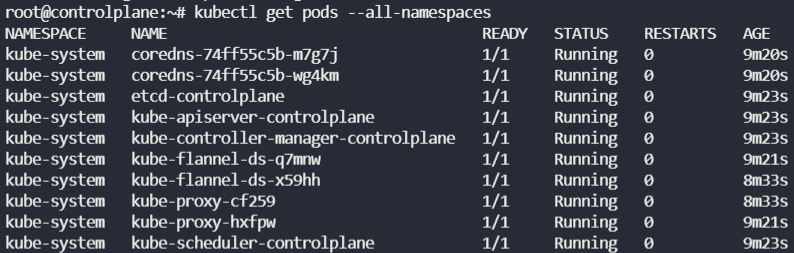

API 서버의 개입없이 kubelet이 자체적으로 생성한 POD 또는 나머지 Kubernetes 클러스터 구성 요소는 정적 POD로 알려져 있다.

```yaml
# kubelet.service

--config=kubeconfig.yaml # 이 옵션 추가
```

* config 옵션을 사용하여 다른 구성 파일의 경로를 제공하고 디렉토리 경로를 정의 할 수 있다.
  해당 파일의 staticPodPath로.

```yaml
# kubeconfig.yaml

staticPodPath: /etc/kubernetes/manifest
```

* 이후 정적 포드에 대한 정의 파일을 배치 할 위치를 알게된다. 구성 파일 내에서 이러한 정적 포드 경로 옵션


##### Static PODs  VS  DaemonSets

| Created by the Kubelet                                       | Created by Kube-API server                            |
| ------------------------------------------------------------ | ----------------------------------------------------- |
| **Deploy Control Plane(API Server?) components as Static Pods** | **Deploy Monitoring Agents, Logging Agents on nodes** |

공통점 : Ignored by the Kube-Scheduler


* 정적 포드를 식별하는 방법 중 하나는 **접미사**를 찾는 것
* 마스터(controlplane)의 영향을 받은 4개를 확인할 수 있음.
  (etcd, kube-apiserver, kube-controller-manager, kube-scheduler)
  (kube-proxy는 DaemonSet으로 배포됨)



* `grep -i static /var/lib/kubelet/config.yaml` 으로
  정적 포드 구성이 저장된 부분을 표시한다.

* `kubectl create service -o yaml --dry-run=client` 서비스에 대한 구성을 생성하지만, 쿠버네티스 API 서버에 전송하는 대신 yaml 형식으로 stdout에 출력한다.

Q) Create a static pod named `static-busybox` that uses the `busybox` image and the command `sleep 1000`

A) `kubectl run --restart=Never --image=busybox static-busybox --dry-run=client -o yaml --command -- sleep 1000 > /etc/kubernetes/manifests/static-busybox.yaml`

Q) 위 이미지를 수정하라

A) `kubectl run --restart=Never --image=busybox:1.28.4 static-busybox --dry-run=client -o yaml --command -- sleep 1000 > /etc/kubernetes/manifests/static-busybox.yaml`

* `ssh <node-name>` 으로 노드에 들어가서 올바르지 않은 yaml 수정 

---

##### Static Pod로 간단한 웹 서버를 구동하는 법

1. Static Pod를 실행할 노드를 선택한다. 이 예제에서는 `my-model` 이다.

   `ssh my-node1`

2. `/etc/kubelet.d`와 같은 디렉터리를 선택하고 웹 서버 파드의 정의를 해당 위치에, 예를 들어 `/etc/kubelet.d/static-web.yaml`에 배치한다.

   ```yaml
   # kubelet이 동작하고 있는 노드에서 이 명령을 수행한다.
   mkdir /etc/kubelet.d/
   cat <<EOF >/etc/kubelet.d/static-web.yaml
   apiVersion: v1
   kind: Pod
   metadata:
     name: static-web
     labels:
       role: myrole
   spec:
     containers:
       - name: web
         image: nginx
         ports:
           - name: web
             containerPort: 80
             protocol: TCP
   EOF
   ```

3. 노드에서 kubelet 실행 시에 `--pod-manifest-path=/etc/kubelet.d/` 와 같이 인자를 제공하여 해당 디렉터리를 사용하도록 구성한다.

   kubectl 구성 파일에 `staticPodPath: <the directory>` 필드를 추가한다.

4. kubelet을 재시작한다.

