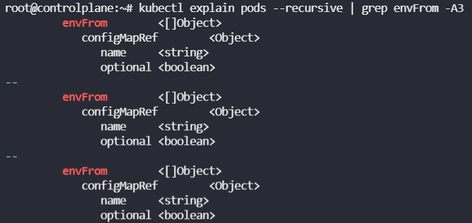

#### ConfigMap

* key-value 쌍으로 기밀이 아닌 데이터를 저장하는 데 사용하는 API 오브젝트이다.
  * 보안 또는 암호화를 제공하지 않는다. 저장하려는 데이터가 기밀인 경우, 컨피그맵 대신 Secret을 사용.
* Pod는 Volume에서 환경 변수, 컴내드-라인 인수 또는 구성 파일로 컨피그맵을 사용할 수 있다.
* `kubectl create configmap` 
  `<config-name> --from-literal=<key>=<value>` 혹은
  `<config-name> --from-file=<path-to-file>`

```yaml
#config-map.yaml
apiVersion: v1
kind: ConfigMap
metadata:
	name: app-config
data:
	APP_COLOR: blue
	APP_MODE: prod
```


Q) Update the environment variable on the POD to display a `green` background

- Pod Name: webapp-color
- Label Name: webapp-color
- Env: APP_COLOR=green

A) 

```yaml
apiVersion: v1
kind: Pod
metadata:
	labels:
		name: webapp-color
	name: webapp-color
spec:
	containers:
	- env:
	  - name: APP_COLOR
	    value: green
	  image: kodekloud/webapp-color
	  name: webapp-color
```


Q) Create a new ConfigMap for the `webapp-color` POD. Use the spec given below.	

- ConfigName Name: webapp-config-map
- Data: APP_COLOR=darkblue


A) `kubectl create cm webapp-config-map --from-literal=APP_COLOR=darkblue`


Q) Update the environment variable on the POD use the newly created ConfigMap

* Pod Name: webapp-color
* EnvFrom: webapp-config-map




A)

```yaml
apiVersion: v1
kind: Pod
metadata:
	labels:
		name: webapp-color
	name: webapp-color
spec:
	containers:
	- envFrom:
	  - configMapRef:
	  	  name: webapp-config-map
	  image: kodekloud/webapp-color
	  imagePullPolicy: Always
	  name: webapp-color
```


