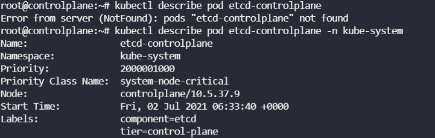
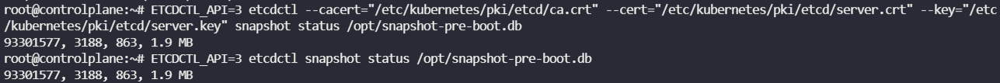
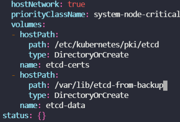
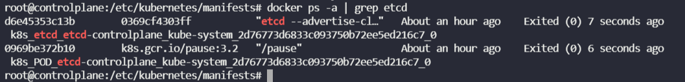
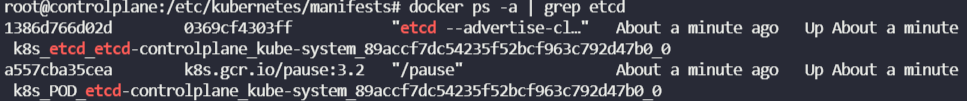

* What is the version of ETCD running on the cluster? 
  Check the ETCD Pod or Process

`kubectl describe pod <pod-name> -n <namespace`

---

참고 : https://kubernetes.io/docs/tasks/administer-cluster/configure-upgrade-etcd/#backing-up-an-etcd-cluster

* 모든 Kubernetes 객체는 etcd에 저장된다. etcd 클러스터 데이터를 정기적으로 백업하는 것이 중요하다.

* ETCD databases snapshot 생성

  `ETCDCTL_API=3 etcdctl snapshot save --help`

  * `-h` 혹은 `--help` 명령어를 통해 GLOBAL OPTIONS를 참조하여 cacert, cert 등을 입력해야한다.

  `kubectl desecribe pod <pod-name> -n <namespace-name>`

  해서 cacert, cert와 key 값을 참조하여 생성.

  `ETCDCTL_API=3 etcdctl --cacert="/etc/kubernetes/pki/etcd/ca.crt" --cert="/etc/kubernetes/pki/etcd/server.crt" --key="/etc/kubernetes/pki/etcd/server.key" snapshot save /opt/snapshot-pre-boot.db`

  

  * status 확인

* 백업 파일을 사용하여 클러스터의 원래 상태를 복원 (Deployments: 2, Services: 3)

  `ETCDCTL_API=3 etcdctl snapshot restore --help`

  `ETCDCTL_API=3 etcdctl snapshot restore /opt/snapshot-pre-boot.db --data-dir=/var/lib/etcd-from-backup`

  인증서, 키, 스냅샷이 이미 경로내에 생성되어 있어서 따로 옵션값을 지정해주지 않아도 된다.

  `cd /etc/kubernetes/manifests/`

  `vi etcd.yaml`

  

  * 볼륨 /var/lib/etcd -> /var/lib/etcd-from-backup으로 백업 파일을 참조할 수 있게 끔 변경

  

  * etcd 이전 컨테이너가 붕괴되고 새로 시작되는 모습

  

