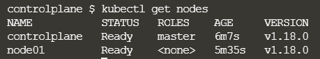
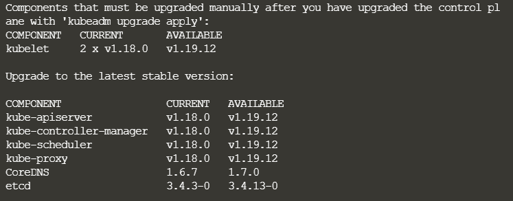
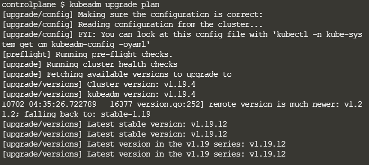
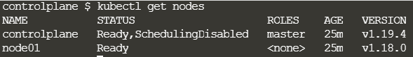
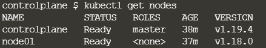
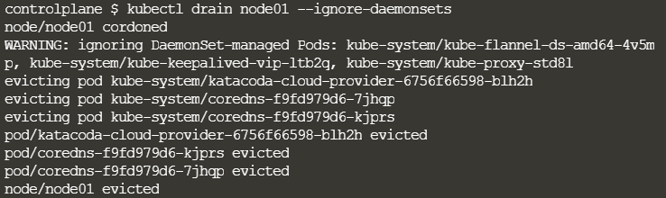
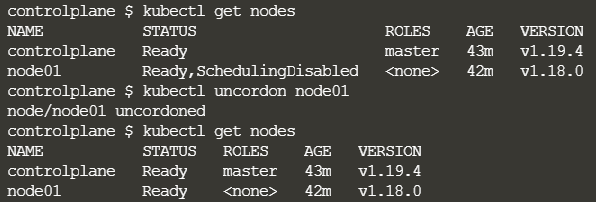

애플리케이션에 액세스하는 사용자가 영향을 받지 않도록 하면서, 클러스터를 업그레이드 하기 위해서 클러스터를 한 번에 한 노드씩 업그레이드하면서 워크로드를 다른 노드로 이동.

##### kubeadm 클러스터 업그레이드

1. The primary control plane node 업그레이드
2. Additional control plane nodes 업그레이드
3. worker nodes 업그레이드

---

* 버전 1.18.0 이상을 실행하는 kubeadm Kubernetes 클러스터가 있어야 한다.
  
  `kubectl get nodes` 



* 이후 업그레이드 할 OS 버전을 확인하기 위한 명령어.
  
  `cat /etc/*release*`
  
  ```
  apt update
  apt-cache madison kubeadm #최신 버전 확인
  ```

#### Controlplane 업그레이드

전반적인 순서

1. 리포지토리 패키지 리스트 업데이트 (apt update)

2. kubeadm 업그레이드 버전 설치 (apt install kubeadm)

3. controlplane 업그레이드 (kubeadm upgrade apply)

4. 예약제거 (kubectl drain <node-name> --ignore-daemonsets)

5. kubelet, kubectl 버전 업그레이드 (apt install kubelet={version})

6. 예약등록 (uncordon)

7. 재기동
* 업그레이드
  
  ```shell
  # 1.19 -> 1.20 바꿀때의 예시
  apt-mark unhold kubeadm && \
  apt-get update && apt-get install -y kubeadm=1.20.0-00 && \
  apt-mark hold kubeadm
  
  apt-get update && \
  apt-get install -y --allow-change-held-packages kubeadm=1.20.0-00
  ```

* 작동 확인
  
  ```shell
  kubeadm version
  kubeadm upgrade plan
  # 클러스터를 업그레이드할 수 있는지를 확인하고, 업그레이드할 수 있는 버전을 가져온다.
  ```
  
  
  
  * upgrade plan 명령어로 Available 버전들 확인한 후 적용
    
    `sudo kubeadm upgrade apply v1.20.0`
    
    

* 성공적으로 업그레이드 되었는지 확인
  
  

* 포드 실행을 담당하고 있기 때문에 컨트롤 플레인 노드를 drain 먼저 시켜주고 업데이트를 해야함.
  
  ` kubectl drain <cp-node-name> --ignore-daemonsets`

* kubelet 및 kubectl 업그레이드
  
  ```shell
  # replace x in 1.19.x-00 with the latest patch version
  apt-mark unhold kubelet kubectl && \
  apt-get update && apt-get install -y kubelet=1.19.4-00 kubectl=1.19.4-00 && \
  apt-mark hold kubelet kubectl
  -
  # since apt-get version 1.1 you can also use the following method
  apt-get update && \
  apt-get install -y --allow-change-held-packages kubelet=1.19.4-00 kubectl=1.19.4-00
  
  # 단순하게 아래 명령어로 업데이트도 가능한 
  apt install kubelet=1.20.0-00
  
  ```
  
  
  
  * Kubelet 다시 시작
  
  ```
  sudo systemctl daemon-reload
  sudo systemctl restart kubelet
  ```
  
  * 예약 가능으로 표시하여 노드를 다시 온라인 상태로 만든다. (현재 SchedulingDisabled)
  
  `kubectl uncordon <cp-node-name>`
  
  

#### Worker node 업그레이드

* 업그레이드
  
  ```
  ssh worker_node
  
  # replace x in 1.20.x-00 with the latest patch version
  apt-mark unhold kubeadm && \
  apt-get update && apt-get install -y kubeadm=1.20.0-00 && \
  apt-mark hold kubeadm
  
  # since apt-get version ?? you can also use the following method
  apt-get update && \
  apt-get install -y --allow-change-held-packages kubeadm=1.20.0-00
  ```

* kubelet 구성 업그레이드
  
  `sudo kubeadm upgrade node`

* 노드 비우기
  
  * 예약 불가능으로 표시하고 워크로드를 제거하여 유지 보수를 위해 노드를 준비
  
  `kubectl drain <node-to-drain> --ignore-daemonsets`
  
  

* kubelet 및 kubectl 업그레이드
  
  ```
  # replace x in 1.19.x-00 with the latest patch version
  apt-mark unhold kubelet kubectl && \
  apt-get update && apt-get install -y kubelet=1.19.4-00 kubectl=1.19.4-00 && \
  apt-mark hold kubelet kubectl
  -
  # since apt-get version 1.1 you can also use the following method
  apt-get update && \
  apt-get install -y --allow-change-held-packages kubelet=1.19.4-00 kubectl=1.19.4-00
  ```

* kubelet 다시 시작
  
  ```
  sudo systemctl daemon-reload
  sudo systemctl restart kubelet
  ```

* 예약 가능 상태로 돌려놓기
  
  `kubectl uncordon <node-to-drain>`
  
  

#### Worker node 2

마스터 노드에 있을 경우 `ssh node명` 으로 접속하여 해당 작업을 진행할 수 있다.

`apt update` - 리포지토리 패키지 업데이트

`apt install kubeadm=1.20.0-00` - kubeadm 업데이트

`kubeadm upgrade node` - kubeadm 적용

`apt install kubelet=1.20.0-00` - kubelet 업데이트

`systemctl restart kubelet` 

참고자료 : https://v1-19.docs.kubernetes.io/docs/tasks/administer-cluster/kubeadm/kubeadm-upgrade/
