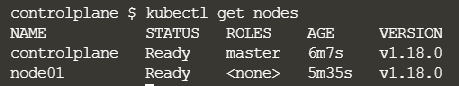
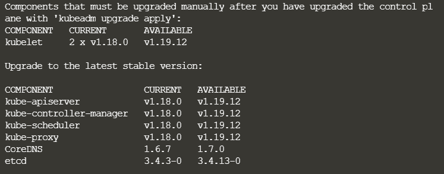
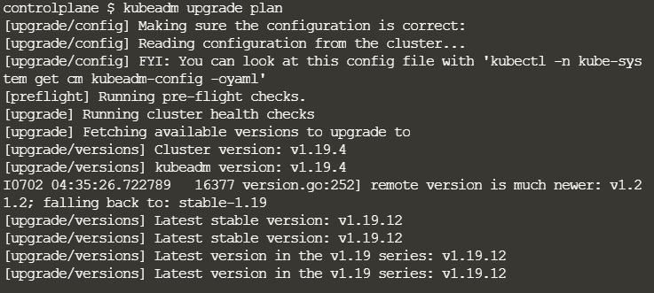
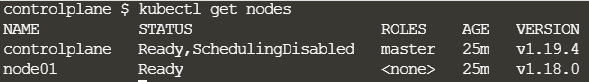
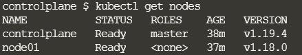
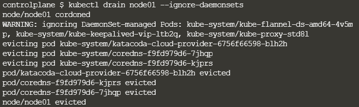
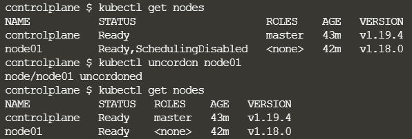

##### kubeadm 클러스터 업그레이드

1. The primary control plane node 업그레이드
2. Additional control plane nodes 업그레이드
3. worker nodes 업그레이드

---

* 버전 1.18.0 이상을 실행하는 kubeadm Kubernetes 클러스가 있어야 한다.

  `kubectl get nodes` 



* 이후 업그레이드 할 OS 버전을 확인하기 위한 명령어.

  `cat /etc/*release*`

  ```
  apt update
  apt-cache madison kubeadm #최신 버전 확인
  ```

#### Controlplane 업그레이드

전반적인 순서

1. 리포지토리 패키지 리스트 업데이트 (apt update)
2. kubeadm 업그레이드 버전 설치 (apt install kubeadm)
3. controlplane 업그레이드 (kubeadm upgrade apply)
4. 예약제거 (kubectl drain <node-name> --ignore-daemonsets)
5. kubelet, kubectl 버전 업그레이드 (apt install kubelet={version})
6. 예약등록 (uncordon)
7. 재기동

* 업그레이드

  ```
  # 위 명령어를 통해 최신 버전을 확인하고 1.19.x-00 바꿔주자.
  apt-mark unhold kubeadm && \
  apt-get update && apt-get install -y kubeadm=1.19.4-00 && \
  apt-mark hold kubeadm
  
  apt-get update && \
  apt-get install -y --allow-change-held-packages kubeadm=1.19.4-00
  ```

* 작동 확인

  ```
  kubeadm version
  sudo kubeadm upgrade plan
  ```

  

  * Available 버전으로 확인

    `sudo kubeadm upgrade apply v1.19.12` 하면 할 수 있는 진행 과정 중 설치했던 패키지 버전 .4 보다 높다고 함. 따라서 .v4로 설치

* 성공적으로 업그레이드 되었는지 확인

  

* 포드 실행을 담당하고 있기 때문에 컨트롤 플레인 노드를 drain 먼저 시켜주고 업데이트를 해야함.

  ` kubectl drain <cp-node-name> --ignore-daemonsets`

* kubelet 및 kubectl 업그레이드

  ```
  # replace x in 1.19.x-00 with the latest patch version
  apt-mark unhold kubelet kubectl && \
  apt-get update && apt-get install -y kubelet=1.19.4-00 kubectl=1.19.4-00 && \
  apt-mark hold kubelet kubectl
  -
  # since apt-get version 1.1 you can also use the following method
  apt-get update && \
  apt-get install -y --allow-change-held-packages kubelet=1.19.4-00 kubectl=1.19.4-00
  ```

  

  * Kubelet 다시 시작

  ```
  sudo systemctl daemon-reload
  sudo systemctl restart kubelet
  ```

  * 예약 가능으로 표시하여 노드를 다시 온라인 상태로 만든다. (현재 SchedulingDisabled)

  `kubectl uncordon <cp-node-name>`

  

#### Worker node 업그레이드

* 업그레이드

  ```
  # replace x in 1.19.x-00 with the latest patch version
  apt-mark unhold kubeadm && \
  apt-get update && apt-get install -y kubeadm=1.19.4-00 && \
  apt-mark hold kubeadm
  -
  # since apt-get version 1.1 you can also use the following method
  apt-get update && \
  apt-get install -y --allow-change-held-packages kubeadm=1.19.4-00
  ```

* kubelet 구성 업그레이드

  `sudo kubeadm upgrade node`

* 노드 비우기

  * 예약 불가능으로 표시하고 워크로드를 제거하여 유지 보수를 위해 노드를 준비

  `kubectl drain <node-to-drain> --ignore-daemonsets`

  

* kubelet 및 kubectl 업그레이드

  ```
  # replace x in 1.19.x-00 with the latest patch version
  apt-mark unhold kubelet kubectl && \
  apt-get update && apt-get install -y kubelet=1.19.4-00 kubectl=1.19.4-00 && \
  apt-mark hold kubelet kubectl
  -
  # since apt-get version 1.1 you can also use the following method
  apt-get update && \
  apt-get install -y --allow-change-held-packages kubelet=1.19.4-00 kubectl=1.19.4-00
  ```

* kubelet 다시 시작

  ```
  sudo systemctl daemon-reload
  sudo systemctl restart kubelet
  ```

* 예약 가능 상태로 돌려놓기

  `kubectl uncordon <node-to-drain>`

  


#### Worker node 2

마스터 노드에 있을 경우 `ssh node명` 으로 접속하여 해당 작업을 진행할 수 있다.

`apt update` - 리포지토리 패키지 업데이트

`apt install kubeadm=1.20.0-00` - kubeadm 업데이트

`kubeadm upgrade node` - kubeadm 적용

`apt install kubelet=1.20.0-00` - kubelet 업데이트

`systemctl restart kubelet` 

참고자료 : https://v1-19.docs.kubernetes.io/docs/tasks/administer-cluster/kubeadm/kubeadm-upgrade/

