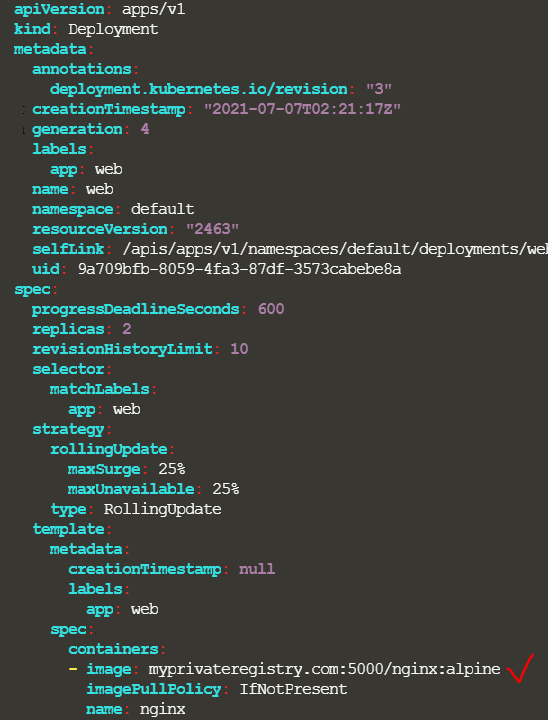

#### 컨테이너 이미지 저장소 보안

`docker login private-registry.io`

`docker run private-registry.io/apps/internal-app`

```yaml
# nginx-pod.yaml
apiVersion: v1
kind: Pod
metadata:
  name: nginx-pod
spec:
  containers:
  - name: nginx
    image: private-registry.io/apps/internal-app
  imagePullSecrets: # 아래 secret 생성하고 난 뒤 추가
  - name: regcred
```

쿠버네티스 내에서 비공개 레지스트리에 액세스하기 위한 자격 증명 얻는 방법

Docker에 자격 증명을 전달하는 방법

1. 자격 증명이 포함된 secret 생성

   ```
   kubectl create secret docker-registry regcred \
   --docker-server=private-registry.io \
   --docker-username=registry-user \
   --docker-password=registry-password \
   --docker-email=registry-user@org.com \
   ```

2. 이후 `imagePullSecrets` 코드 추가

---

Q) 

We decided to use a modified version of the application from an internal private registry. Update the image of the deployment to use a new image from `myprivateregistry.com:5000`

The registry is located at `myprivateregistry.com:5000`. Don't worry about the credentials for now. We will configure them in the upcoming steps.


A) 

`kubectl edit deployment <image-name>`  




Q) 

Create a secret object with the credentials required to access the registry

Name: `private-reg-cred`
Username: `dock_user`
Password: `dock_password`
Server: `myprivateregistry.com:5000`
Email: `dock_user@myprivateregistry.com`


A) 

```
kubectl create secret docker-registry private-reg-cred \
> --docker-username=dock_user \
> --docker-email=dock_user@myprivateregistry.com \
> --docker-server=myprivateregistry.com:5000 \
> --docker-password=dock_password
```


이후 imagePullSecrets 추가
