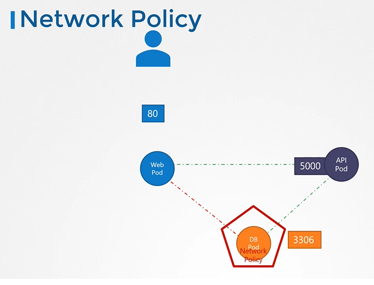
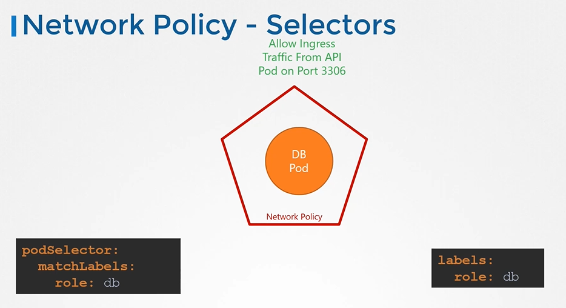
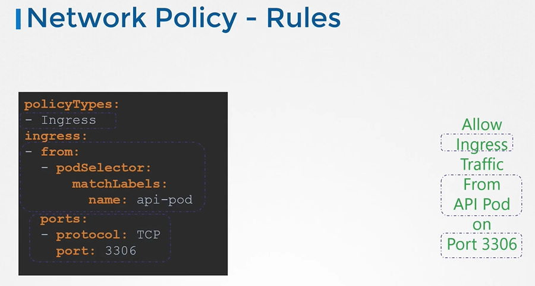

* Kubernetes는 기본적으로 모든 포드에서 다른 포드로의 트래픽을 허용하는 "모든 허용" 규칙으로 구성된다.



* API 서버에서만 DB 서버로 트래픽을 허용하는 네트워크 정책을 구현
  * 네트워크 정책은 Pod와 ReplicaSet 처럼 쿠버네티스 네임스페이스 개체이다.
  * 네트워크 정책을 하나 이상의 포드에 적용하여 그 포드에서만 해당 정책이 활성되게 끔 한다.

##### 네트워크 정책 연결하는 법



* 포드에 `labels`을 지정하고, 네트워크 정책의 `podSelector`에 동일한 `label`을 지정한다.

* 규칙이 수신 또는 송신 트래픽 혹은 모두 허용하는지 지정한다.

##### DB Pod에 대한 수신 트래픽만 허용하는 네트워크 정책 구성




```yaml
apiVersion: networking.k8s.io/v1
kind: NetworkPolicy
metadata:
 name: db-policy
spec:
  podSelector:
    matchLabels:
      role: db
  policyTypes:
  - Ingress
  ingress:
  - from:
    - podSelector:
        matchLabels:
          role: api-pod
      namespaceSelector:
        matchLabels:
          name: prod
    ports:
    - protocol: TCP
      port: 3306
```

* 위처럼  `namespaceSelector` 로 정의하였는데 이는 두 인자로 필터링 된 Pod만 허용하겠다는 것인데, 인자 앞에 `- namespaceSelector` 처럼 - 를 붙이면 개별로 들어가서 허용범위가 넓어지는 결과를 이끌어낼 수 도 있으므로 사용에 주의해야한다.

---

```yaml
apiVersion: networking.k8s.io/v1
kind: NetworkPolicy
metadata:
  name: db-policy
spec:
  podSelector:
    matchLabels:
      role: db
  policyTypes:
  - Ingress
  - Egress
  ingress:
  - from:
    - podSelector:
        matchLabels:
          name: api-pod
    ports:
    - protocol: TCP
      port: 3306
      
  egress:
  - to:
    - ipBlock:
        cidr: 192.168.5.10/32
    ports:
    - protocol: TCP
      port: 80
```

* ingress, egress 모두 사용

---

`kubectl get networkpolicy`

Q)

Create a network policy to allow traffic from the 'Internal' application only to the 'payroll-service' and 'db-service'

Use the spec given on the right. You might want to enable ingress traffic to the pod to test your rules in the UI.

- Policy Name: internal-policy
- Policy Types: Egress
- Egress Allow: payroll
- Payroll Port: 8080
- Egress Allow: mysql
- MYSQL Port: 3306


A)

```yaml
apiVersion: networking.k8s.io/v1
kind: NetworkPolicy
metadata:
  name: internal-policy
  # namespace: default
spec:
  podSelector:
    matchLabels:
      name: internal
  policyTypes:
  - Egress
  egress:
  - to:
    - podSelector:
        matchLabels:
          name: mysql
    ports:
    - protocol: TCP
      port: 3306

  - to:
    - podSelector:
        matchLabels:
          name: payroll
    ports:
    - protocol: TCP
      port: 8080
```

