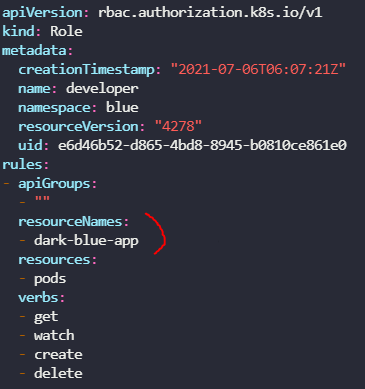
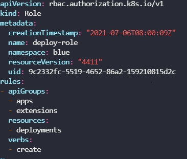
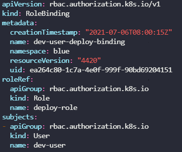

### RBAC(Role Based Access Control)

* Role을 생성하여 각각의 Role에 권한을 세부적으로 명시하고, RoleBinding을 통해 특정 Role을 사용자에게 종속시키는 방식으로 사용자에게 권한을 할당한다. 

* namespace 범위의 권한 할당은 Role과 RoleBinding을 사용.
* cluster 범위의 권한 할당은 ClusterRole과 ClusterRoleBinding을 사용.

---

##### Role & RoleBinding

```yaml
#developer-role.yaml
apiVersion: rbac.authorization.k8s.io/v1
kind: Role
metadata:
  name: developer
  #namespace: default
rules:
- apiGroups: [""] # 핵심 API 그룹을 명시
  resources: ["pods"] # deployment, namesapce, secret, configmap, service
  verbs: ["get", "list", "watch", "create", "delete", "update", "edit", "exec"]
  resourceNames: ["blue", "orange"] # 특정 Pod에 대한 액세스 제한

- apiGroups: [""]
  resources: ["ConfigMap"]
  verbs: ["create"]
```

`kubectl create -f developer-role.yaml`

```yaml
#devuser-developer-binding.yaml
apiVersion: rbac.authorization.k8s.io/v1
kind: RoleBinding
metadata:
  name: devuser-developer-binding
  #namespace: default
subjects:
- kind: User
  name: dev-user # 이름은 대소문자를 구분한다.
  apiGroup: rbac.authorization.k8s.io
roleRef:
  kind: Role # 이것은 반드시 Role 혹은 ClusterRole이어야 한다.
  name: developer # Role의 name과 일치해야 한다.
  apiGroup: rbac.authorization.k8s.io
```

`kubectl get roles`

`kubectl get rolebindings`

`kubectl describe role <role-name>`

* dev-user로서 명령어를 사용 (권한 확인) (`--as {user}`)

  `kubectl get pods --as dev-user` 와 같이 사용

* 할당할 수 있는 자원을 확인

  `kubectl api-resources`

  `kubectl api-resources --namespaced=true|false`

`kubectl create role developer --resource=pods --verb=list,create`

`kubectl create rolebinding dev-user-binding --role=developer --user=dev-user`

Q) `dev-user`가 `blue`  namespace의 `dark-blue-app` 파드 상세정보를 얻을 수 있게 수정하라.

A) 

`kubectl get role -A` 하여 네임스페이스의 role 이름을 확인

`kubectl edit role {role} -n {namespace}`



resourceNames에 해당 Pod를 추가시켜준다.


Q) 

Grant the `dev-user` permissions to create deployments in the `blue` namespace.

Remember to add both groups `"apps"` and `"extensions"`.

A) 

`kubectl create role deploy-role --verb=create --resource=deployments.apps --namespace=blue`

위처럼 하고 edit해서 extentsion도 추가

`kubectl create rolebinding deploy-rolebinding --user=dev-user --role=deploy-role --namespace=blue`

yaml 파일로도 작성






---

##### ClutserRole & ClutserRoleBinding

```yaml
#cluster-admin-role.yaml
apiVersion: rbac.authorization.k8s.io/v1
kind: ClusterRole
metadata:
  name: cluster-administrator
rules:
- apiGroups: [""]
  resources: ["nodes"]
  verbs: ["list", "get", "create", "delete"]
```

```yaml
#cluster-admin-role-binding.yaml
apiVersion: rbac.authorization.k8s.io/v1
kind: ClusterRoleBinding
metadata:
  name: cluster-admin-role-binding
subjects:
- kind: User
  name: cluster-admin
  apiGroup: rbac.authorization.k8s.io
roleRef:
  kind: ClusterRole
  name: cluster-administrator
  apiGroup: rbac.authorization.k8s.io
```

