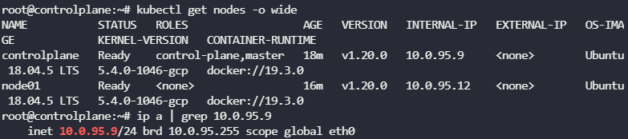

Q) What is the network interface configured for cluster connectivity on the master node?

마스터 노드에서 클러스터 연결을 위해 구성된 **네트워크 인터페이스**는 무엇인가?

A) `kubectl get nodes -o wide` 

`ip a | grep {node's internal ip}`

---

Q) What is the MAC address of the interface on the master node?

마스터 노드에 있는 인터페이스의 **MAC 주소**는 무엇인가?

A) `ip link`   `ip link show eth0`

---

Q) What is the MAC address assigned to `node01`?

`node01`에 할당된 **MAC 주소**는 무엇인가?

A)`arp node01`

---

Q) We use Docker as our container runtime. What is the interface/bridge created by Docker on this host?

A) `ip link`

---

Q) If you were to ping google from the master node, which route does it take?

What is the IP address of the Default Gateway?

마스터 노드에서 Google에 ping을 실행하기 위해서 어떤 route가 필요한가?

A) `ip r` `ip route` 하여 default 기본 경로 찾기

---

Q) What is the port the `kube-scheduler` is listening on in the controlplane node?

A) `netstat -ntlp`

---

Q) Notice that ETCD is listening on two ports. Which of these have more client connections established?

A)  `netstat -anp | grep etcd`

2379는 모든 컨트롤 플레인 구성 요소가 연결되는 ETCD의 포트이기 때문 2380은 etcd peer to peer 연결 전용이다.

