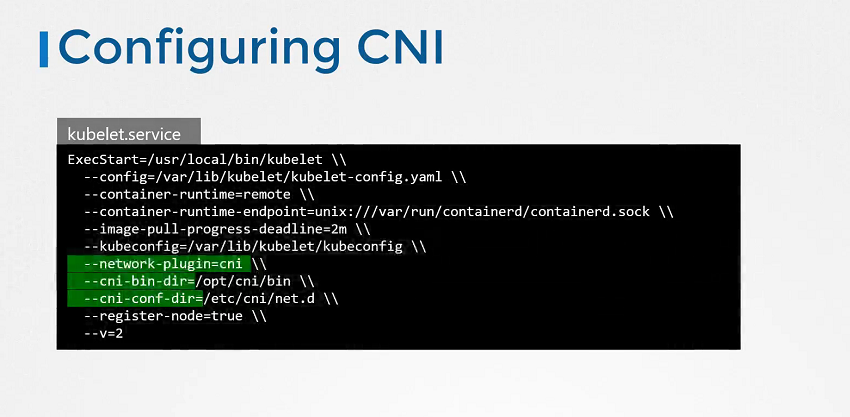

##### CNI(Container Networking Interface)

* CNI 플러그인은 클러스터의 각 노드에서 kubelet.service에 구성된다.

* kubelet 서비스 상태 확인

`systemctl status kubelet.service`

* kubelet 옵션 보기

`ps -aux | grep kubelet`

---

##### 지원 가능한 플러그인 확인

* `/opt/cni/bin` 디렉토리에서 사용할 수 있는 모든 지원 가능한 플러그인을 확인한다.

  `ls /opt/cni/bin`

---

##### CNI 플러그인 확인

* kubelet을 사용해야 하는 cni 플러그인을 확인

  `ls /etc/cni/net.d`

##### 구성 파일 형식

