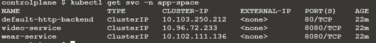

`kubectl get ingress -A`

https://kubernetes.io/docs/concepts/services-networking/ingress/#the-ingress-resource

https://kubernetes.io/docs/concepts/services-networking/ingress/#resource-backend

```yaml
apiVersion: networking.k8s.io/v1
kind: Ingress
metadata:
  name: ingress-wear-watch
  namespace: app-space
spec:
  rules:
  - http:
      paths:
      - path: /wear
        pathType: ImplementationSpecific
        backend:
          service:
            name: wear-service
            port:
              number: 8080
      - path: /stream
        pathType: ImplementationSpecific
        backend:
          service:
            name: video-service
            port:
              number: 8080
```

---

Q)  create a service to make Ingress available to external users.

- Name: ingress
- Type: NodePort
- Port: 80
- TargetPort: 80
- NodePort: 30080
- Use the right selector

A) `kubectl -n ingress-space expose deployment ingress-controller --name ingress --port 80 --target-port 80 --type NodePort --dry-run=client -o yaml > ingress.svc.yaml`

```yaml
apiVersion: v1
kind: Service
metadata:
  creationTimestamp: null
  name: ingress
  namespace: ingress-space
spec:
  ports:
  - port: 80
    protocol: TCP
    targetPort: 80
    nodePort: 30080
  selector:
    name: nginx-ingress
  type: NodePort
status:
  loadBalancer: {}
```

---

Q) Create the ingress resource to make the applications available at /wear and /watch on the Ingress service. Create the ingress in the app-space

- Path: /wear
- Path: /watch

A) 



먼저 app-space 네임스페이스안의 서비스를 확인하여 서비스 이름과 포트를 본다.

이후 [Ingress | Kubernetes](https://kubernetes.io/docs/concepts/services-networking/ingress/) 문서를 참고하여 ingress를 생성.

```yaml
apiVersion: networking.k8s.io/v1
kind: Ingress
metadata:
  namespace: app-space
  name: minimal-ingress
  annotations:
    nginx.ingress.kubernetes.io/rewrite-target: /
spec:
  rules:
  - http:
      paths:
      - path: /wear
        pathType: Prefix
        backend:
          service:
            name: wear-service
            port:
              number: 8080
      - path: /watch
        pathType: Prefix
        backend:
          service:
            name: video-service
            port:
              number: 8080
```

