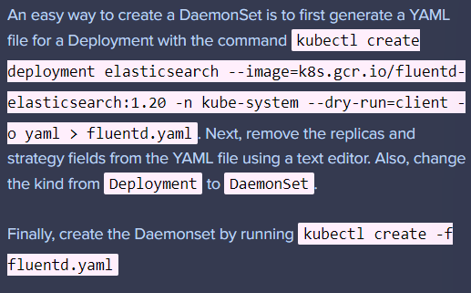

### 데몬셋

* 모든 노드가 파드의 사본을 실행하도록 한다. 
  파드의 복제본을 클러스터 노드 집합에서 동작하게 한다.
* 데몬셋의 용도는 다음과 같다.
  * 모든 노드에서 클러스터 스토리지 데몬 실행
  * 모든 노드에서 로그 수집 데몬 실행
  * 모든 노드에서 노드 모니터링 데몬 실행




```
Deploy a DaemonSet for `FluentD` Logging. Use the given specifications.

- Name: elasticsearch
- Namespace: kube-system
- Image: k8s.gcr.io/fluentd-elasticsearch:1.20
```

* DaemonSet은 Deployment와 구조가 비슷하기 때문에 deployment를 생성하고 kind를 바꿔주는 방식을 사용


