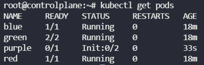

#### Init Container

초기화 컨테이너는 파드의 앱 컨테이너들이 실행되기 전에 실행되는 특수한 컨테이너이며, 앱 이미지에는 없는 유틸리티 또는 설정 스크립트 등을 포함할 수 있다.

다음의 경우를 제외하면, 초기화 컨테이너는 일반적인 컨테이너와 매우 유사하다.

* 초기화 컨테이너는 항상 완료를 목표로 실행된다.
* 각 초기화 컨테이너는 다음 초기화 컨테이너가 시작되기 전에 성공적으로 완료되어야 한다.


```yaml
apiVersion: v1
kind: Pod
metadata:
	name: myapp-pod
	labels:
		app: myapp
spec:
	containers:
	- name: myapp-container
	  image: busybox:1.28
	  command: ['sh', '-c', "until nslookup myservice.$(cat /var/run/secrets/kubernetes.io/serviceaccount/namespace).svc.cluster.local; do echo waiting for myservice; sleep 2; done"]
  - name: init-mydb
    image: busybox:1.28
    command: ['sh', '-c', "until nslookup mydb.$(cat /var/run/secrets/kubernetes.io/serviceaccount/namespace).svc.cluster.local; do echo waiting for mydb; sleep 2; done"]
    
```

* 위 yaml 파일은 두 개의 초기화 컨테이너를 포함한 간단한 파드에 대한 개요를 보여준다.
  첫 번째는 `myservice`를 기다리고 두 번째는 `mydb`를 기다린다. 두 컨테이너들이 완료되면, 파드가 시작된다.


