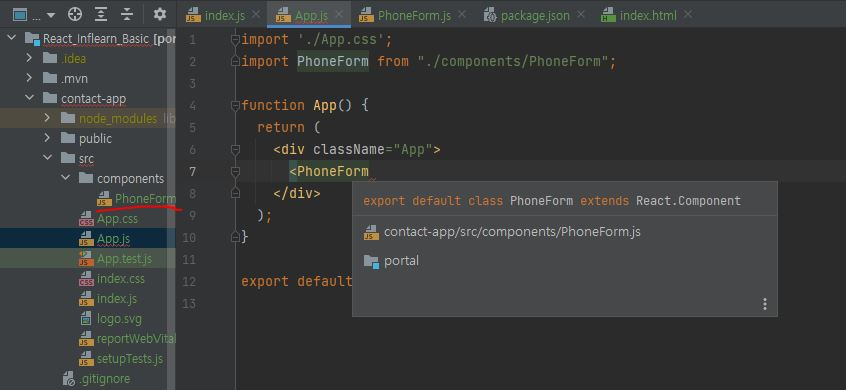
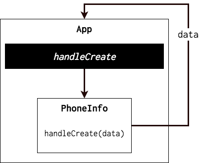
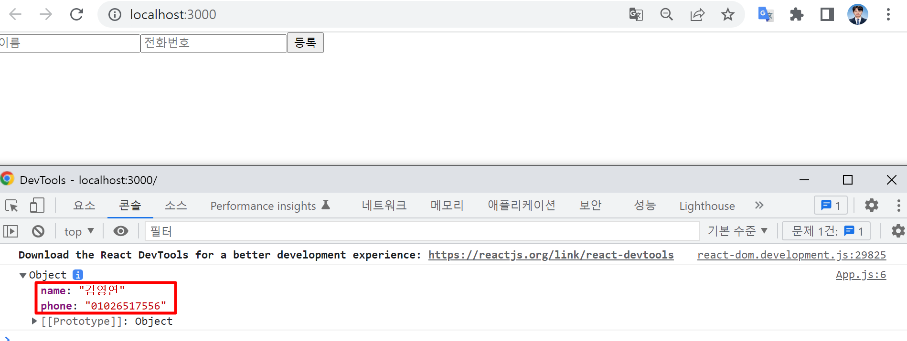

##### 환경 설정

1. node js 설치 (LTS)
2. yarn 설치 (https://classic.yarnpkg.com/en/docs/install#windows-stable)
3. `npx create-react-app contact-app` 프로젝트 생성
4. `npm start`

---

#### 컴포넌트 작성

* Intellij `React snippet` 플러그인을 설치하여 사용
  * `rcc` 명령어를 입력하면, 클래스 형태로 컴포넌트를 자동 생성해준다.
  * `rsc` 명령어를 입력하면, 함수 형태로 컴포넌트를 자동 생성해준다.

* `src/components` 디렉토리 생성 후 `PhoneForm.js` 파일 생성

```react
import React, {Component} from 'react';

class PhoneForm extends Component {
    render() {
        return (
            <div>
                PhoneForm
            </div>
        );
    }
}

export default PhoneForm;
```

* 이후 해당 PhoneForm 컴포넌트를 사용하기 위해, 아래 사진상 2번째 라인의 import 구문을 작성할 필요 없이 코드 내에서 바로 렌더링을 해줄 수 있다.



``` react
import React, {Component} from 'react';

class PhoneForm extends Component {
    state = {
        name: '',
        phone: '',
    }

    handleChange = (e) => {
        this.setState({
            [e.target.name]: e.target.value
        });
    }

    render() {
        return (
            <form>
                <input
                    name={"name"}
                    placeholder="이름"
                    onChange={this.handleChange}
                    value={this.state.name}
                />
                <input
                    name={"phone"}
                    placeholder="전화번호"
                    onChange={this.handleChange}
                    value={this.state.phone}
                />
                <div>
                    {this.state.name} {this.state.phone}
                </div>
            </form>
        );
    }
}

export default PhoneForm;

```

* handleChange: input에서 변경이벤트가 발생될때 처리할 함수, e라는 이벤트 객체를 파라미터로 받는다.
* `<input onChange={this.handleChange}/>` input 에서 값이 들어올 때 마다 name이 변경될 것.

* `placeholder`: 아무것도 입력되지 않았을 때 회색글씨로 input 창에 보여지는 값.

* `[e.target.name]`: input 태그 안의 name 값이 들어오게 됨.

---

#### 자식 컴포넌트가 부모한테 값 전달하기



* App.js 에서 handleCreate 메소드를 만들고, 이를 PhoneForm 한테 전달한다. 

```react
import React, { Component } from "react";
import PhoneForm from "./components/PhoneForm";

class App extends Component {
    handleCreate = (data) => {
        console.log(data);
    }
    render() {
        return (
            <div>
                <PhoneForm
                    onCreate={this.handleCreate}
                />
            </div>
        );
    }
}

export default App;
```

* 그리고, PhoneForm 쪽에서 버튼을 만들어서 submit 이 발생하면 props 로 받은 함수를 호출하여 App 에서 파라미터로 받은 값을 사용 할 수 있도록 한다.

```react
// 버튼 및 onSubmit 이벤트를 설정
import React, {Component} from 'react';

class PhoneForm extends Component {
    state = {
        name: '',
        phone: '',
    }

    handleChange = (e) => {
        this.setState({
            [e.target.name]: e.target.value
        });
    }

    handleSubmit = (e) => {
        // 페이지 리로딩 방지
        e.preventDefault();
        // 상태 값을 onCreate를 통하여 부모에게 전달
        this.props.onCreate(this.state);
        // 상태 초기화
        this.setState({
            name: '',
            phone: '',
        });
    }

    render() {
        return (
            <form onSubmit={this.handleSubmit}>
                <input
                    name={"name"}
                    placeholder="이름"
                    onChange={this.handleChange}
                    value={this.state.name}
                />
                <input
                    name={"phone"}
                    placeholder="전화번호"
                    onChange={this.handleChange}
                    value={this.state.phone}
                />
                <button type={"submit"}>등록</button>
            </form>
        );
    }
}

export default PhoneForm;
```

* `e.preventDefault()`: form에서 submit이 발생하면 페이지를 다시 불러오게 되는데 그럴 경우 가지고 있는 상태 값을 전부 잃기 때문에 해당 이벤트로 일어나는 작업을 방지하는 역할.
* `this.props.onCreate`: 이후 props로 받은 onCreate 함수를 호출하고, 상태 값을 초기화한다.
* render 안에 submit 버튼 및 form 안에 onSubmit 이벤트를 등록.



---

#### 배열 다루기

* 리액트에서는 state 내부의 값을 직접적으로 수정하면 안된다.
* 기존의 배열에 기반하여 새 배열을 만들어내는 `concat`, `slice`, `map`, `filter` 와 같은 함수를 사용해야 한다.

##### 데이터 추가

* App 컴포넌트의 state에 information이라는 배열을 만들고, 동적으로 데이터를 화면에서 넣어서 잘 입력 되는지 확인
* 각 전화번호 정보는 다음과 같은 형식으로 담는다.
  * id는 각 데이터를 식별하기 위함이고, 데이터를 추가할 때마다 숫자를 1씩 더해준다.

```react
{
	id: 0,
	name: '김영연',
	phone: '010-2651-7556'
}
```

```react
// App.js
import React, {Component} from "react";
import PhoneForm from "./components/PhoneForm";
import PhoneInfoList from "./components/PhoneInfoList";

class App extends Component {
    id = 0;
    state = {
        information: [],
    }
    handleCreate = (data) => {
        const { information } = this.state;
        this.setState({
           information: information.concat(Object.assign({}, data, {
               id: this.id++
           }))
        });
    }

    render() {
        return (
            <div>
                <PhoneForm onCreate={this.handleCreate}/>
                <PhoneInfoList data={this.state.information} />
            </div>
        )
    }
}

export default App;
```

* 


