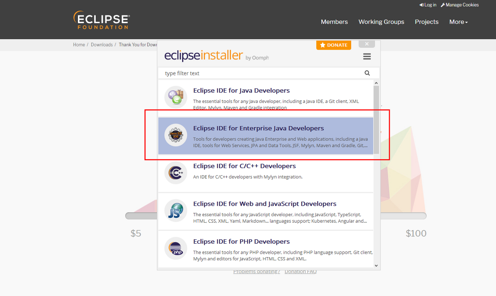

### Spring Boot

* 최소한의 설정으로 스프링 기반 애플리케이션을 개발할 수 있도록 도와주는 스프링 프레임워크의 프로젝트
* 다양한 기능들이 xml이나 JavaConfig 설정을 하지 않아도 자동으로 설정된다.
  -> 복잡한 Configuration 설정을 예약된 Property 키 값에 설정하는 것만으로 대체할 수 있다.
  따라서, 프로젝트 세팅에 들이는 시간을 최소화하여 개발에 집중을 돕기 때문에 기존의 Spring MVC Project보다 쉽게 웹 개발을 할 수 있다.

0. demo라는 프로젝트를 구성할 것이고, JDK 8 버전에 빌드도구는 Maven, IDE(통합 개발 환경)는 Eclipse를 사용한다.

1. 이클립스 설치

   https://www.eclipse.org/downloads/

   

2. Eclipse Marketplace

   

3. sts 검색하여 Spring Tolls 3 (Standalone Edition) 설치

   

4. Open Perspective 에 Spring 항목이 추가된 것을 확인.

   


```xml
<dependency>
	<groupId>org.springframework.boot</groupId>
	<artifactId>spring-boot-starter-web</artifactId>
</dependency>
<dependency>
	<groupId>org.springframework.boot</groupId>
	<artifactId>spring-boot-devtools</artifactId>
	<scope>runtime</scope>
	<optional>true</optional>
</dependency>
<dependency>
	<groupId>org.projectlombok</groupId>
	<artifactId>lombok</artifactId>
	<optional>true</optional>
</dependency>
```

* 위와 같이 pom.xml에 의존성이 추가된 것을 확인.

5. 수동 빌드를 위한 Project -> Build Automatically 해제

   단축키 : `Ctrl+b`

6. Maven Repository Update

   pom.xml에 dependencies 정보 등 수정되었을 경우 반드시 실행해주어야 한다.

   프로젝트 우클릭 - Maven - Update Project

   단축키 : `Alt+F5`

7. TestController Class 생성

   

8. 빌드 후 실행

   프로젝트 생성시 packaging을 jar로 설정했는데 패키징을 jar로 설정할 경우, 빌드시 실행가능한 jar파일(실행가능한 아카이브 패키징)을 만들어 줍니다.

   기존의 War의 경우, WAS에 배포한 후 실행했었다면, jar는 단독 앱으로 실행이 가능하다는 점에서 보다 편리.
   이제는 앱을 WAS에 올리지 않고, Spring Boot 앱을 바로 실행시키면 된다.

   프로젝트 우클릭 - Run As - Spring Boot APP

9. 결과 확인

   

10. resources/static 아래에 index.html을 생성 후 해당 페이지 접근

    


