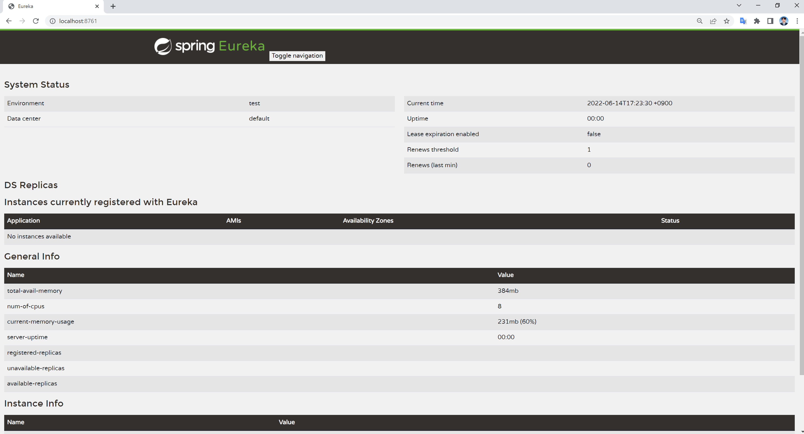

##### Service Discovery 

* MSA와 같은 분산 환경은 서비스 간의 원격 호출로 구성이 된다. 원격 서비스 호출은 IP 주소와 포트를 이용하는 방식이 되는다. 
* 클라우드 환경이 되면서 서비스가 오토 스케일링 등에 의해서 동적으로 생성되거나 컨테이너 기반의 배포로 인해서, 서비스의 IP가 동적으로 변경되는 일이 잦아졌다. 
* 그래서 서비스 클라이언트가 서비스를 호출할때 서비스의 위치 (즉 IP주소와 포트)를 알아낼 수 있는 기능이 필요한데, 이것을 바로 서비스 디스커버리 (Service discovery)라고 한다.

---

* 참고 Docs 
  https://cloud.spring.io/spring-cloud-netflix/multi/multi_spring-cloud-eureka-server.html

##### SpringDiscovery 프로젝트 생성

* Spring Cloud Discovery - Eureka Server 의존성 추가

  

* 메인 애플리케이션 (Eureka Server)

  ```java
  import org.springframework.boot.SpringApplication;
  import org.springframework.boot.autoconfigure.SpringBootApplication;
  import org.springframework.cloud.netflix.eureka.server.EnableEurekaServer;
  
  @SpringBootApplication
  @EnableEurekaServer // 어노테이션 추가
  public class SpringDiscoveryApplication {
  
      public static void main(String[] args) {
          SpringApplication.run(SpringDiscoveryApplication.class, args);
      }
  
  }
  ```

* application.yml

  ```yaml
  server:
    port: 8761
  
  spring:
    application:
      name: SpringDiscovery
  
  eureka:
    client:
      register-with-eureka: false
      fetch-registry: false
  ```

* Eureka 접속

  

---

##### SpringDiscoveryService 프로젝트 생성

* 의존성 추가하여 프로젝트 생성

  

* 메인 애플리케이션 (Eureka Client)

  ```java
  import org.springframework.boot.SpringApplication;
  import org.springframework.boot.autoconfigure.SpringBootApplication;
  import org.springframework.cloud.client.discovery.EnableDiscoveryClient;
  
  @SpringBootApplication
  @EnableDiscoveryClient
  public class SpringDiscoveryServiceApplication {
  
      public static void main(String[] args) {
          SpringApplication.run(SpringDiscoveryServiceApplication.class, args);
      }
  
  }
  ```

* application.yml

  ```yaml
  server:
    port: 9001
  
  spring:
    application:
      name: SpringDiscoveryService
  
  eureka:
    client:
      register-with-eureka: true
      fetch-registry: true
      service-url:
        defaultZone: http://127.0.0.1.:8761/eureka
  ```

* Eureka 서비스 목록 확인

  ```java
  // 아래와 같은 로그가 찍힘
  INFO 20780 --- [nio-8761-exec-8] c.n.e.registry.AbstractInstanceRegistry  : Registered instance SPRINGDISCOVERYSERVICE/yeongyeon-kim.hwk.net:SpringDiscoveryService:9001 with status UP (replication=false)
  INFO 20780 --- [nio-8761-exec-6] c.n.e.registry.AbstractInstanceRegistry  : Registered instance SPRINGDISCOVERYSERVICE/yeongyeon-kim.hwk.net:SpringDiscoveryService:9001 with status UP (replication=true)
  INFO 20780 --- [nio-8761-exec-3] c.n.e.registry.AbstractInstanceRegistry  : Registered instance SPRINGDISCOVERYSERVICE/yeongyeon-kim.hwk.net:SpringDiscoveryService:9002 with status UP (replication=false)
  INFO 20780 --- [nio-8761-exec-4] c.n.e.registry.AbstractInstanceRegistry  : Registered instance SPRINGDISCOVERYSERVICE/yeongyeon-kim.hwk.net:SpringDiscoveryService:9002 with status UP (replication=true)
  ```

  

* 서비스 추가 등록

  

* Eureka 서비스 목록에 추가된 것 확인

  

ㅇ
